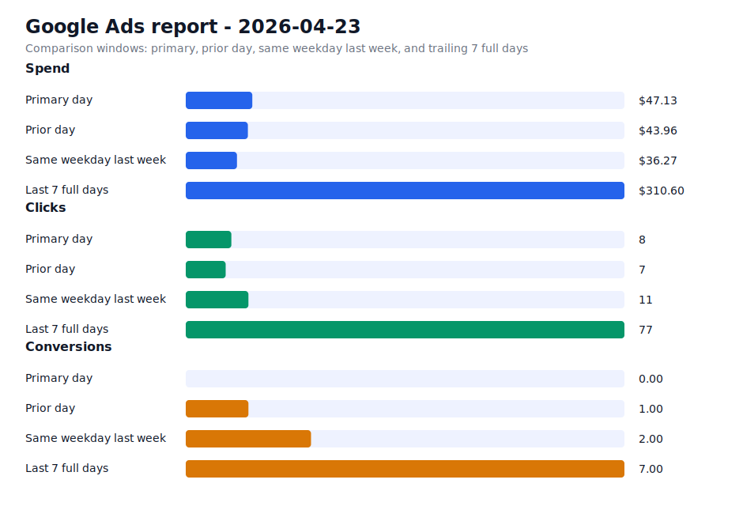

# Daily Ads Report - 2026-04-23

Source: Google Ads API REST via local `.env` credentials
Credential file: `/Users/dax/bomi/bomi-ads/.env`
Generated: 2026-04-24T01:22:04-07:00
Account: Bomi Health, Inc. / `5613091482`
Timezone: America/Los_Angeles
Primary window: 2026-04-23

## Executive Readout

Primary-day spend was $47.13 on 8 clicks and 0.00 conversions, for a blended CPA of n/a.

## Visual Summary

## Scorecard

| Window | Cost | Impressions | Clicks | CTR | Avg CPC | Conversions | CPA |
| --- | ---: | ---: | ---: | ---: | ---: | ---: | ---: |
| Primary day | $47.13 | 186 | 8 | 4.30% | $5.89 | 0.00 | n/a |
| Prior day | $43.96 | 222 | 7 | 3.15% | $6.28 | 1.00 | $43.96 |
| Same weekday last week | $36.27 | 346 | 11 | 3.18% | $3.30 | 2.00 | $18.14 |
| Last 7 full days | $310.60 | 1,135 | 77 | 6.78% | $4.03 | 7.00 | $44.37 |

## Campaigns

| Campaign | Status | Budget | Cost | Clicks | Impressions | Conversions | CPA |
| --- | --- | ---: | ---: | ---: | ---: | ---: | ---: |
| `General Bomi Leads` | ENABLED | $25.00 | $30.04 | 3 | 91 | 0.00 | n/a |
| `schedule meeting` | ENABLED | $15.00 | $17.09 | 5 | 95 | 0.00 | n/a |
| `schedule meeting - Indiana 1777010299107` | ENABLED | $15.00 | $0.00 | 0 | 0 | 0.00 | n/a |
| `schedule meeting - Ohio 1777010295580` | ENABLED | $15.00 | $0.00 | 0 | 0 | 0.00 | n/a |

## Search Terms

| Campaign | Search term | Cost | Clicks | Impressions | Conversions | CPA |
| --- | --- | ---: | ---: | ---: | ---: | ---: |
| `General Bomi Leads` | `caqh proview phone number` | $5.51 | 1 | 1 | 0.00 | n/a |
| `schedule meeting` | `medical billing company` | $3.03 | 1 | 1 | 0.00 | n/a |
| `schedule meeting` | `medical billing solutions` | $2.53 | 1 | 1 | 0.00 | n/a |
| `schedule meeting` | `omni medical billing` | $1.83 | 1 | 2 | 0.00 | n/a |
| `schedule meeting` | `cloud based practice management software` | $0.99 | 1 | 1 | 0.00 | n/a |
| `schedule meeting` | `authorization in medical billing` | $0.00 | 0 | 1 | 0.00 | n/a |
| `schedule meeting` | `best medical billing software for mental health` | $0.00 | 0 | 1 | 0.00 | n/a |
| `schedule meeting` | `medical billing` | $0.00 | 0 | 1 | 0.00 | n/a |
| `schedule meeting` | `medical billing services` | $0.00 | 0 | 1 | 0.00 | n/a |
| `schedule meeting` | `provider enrollment and credentialing services` | $0.00 | 0 | 1 | 0.00 | n/a |
| `General Bomi Leads` | `apply for npi` | $0.00 | 0 | 1 | 0.00 | n/a |
| `General Bomi Leads` | `argus insurance provider portal` | $0.00 | 0 | 2 | 0.00 | n/a |
| `General Bomi Leads` | `caqh number lookup` | $0.00 | 0 | 1 | 0.00 | n/a |
| `General Bomi Leads` | `caqh phone number` | $0.00 | 0 | 1 | 0.00 | n/a |
| `General Bomi Leads` | `claimchoice provider portal` | $0.00 | 0 | 2 | 0.00 | n/a |
| `General Bomi Leads` | `cloudrcm solutions` | $0.00 | 0 | 1 | 0.00 | n/a |
| `General Bomi Leads` | `coronis health` | $0.00 | 0 | 2 | 0.00 | n/a |
| `General Bomi Leads` | `credentialing` | $0.00 | 0 | 1 | 0.00 | n/a |
| `General Bomi Leads` | `health care service corporation provider portal` | $0.00 | 0 | 1 | 0.00 | n/a |
| `General Bomi Leads` | `home health agency license` | $0.00 | 0 | 3 | 0.00 | n/a |
| `General Bomi Leads` | `how to create a superbill` | $0.00 | 0 | 1 | 0.00 | n/a |
| `General Bomi Leads` | `hpi provider portal` | $0.00 | 0 | 1 | 0.00 | n/a |
| `General Bomi Leads` | `humana contracting and credentialing` | $0.00 | 0 | 1 | 0.00 | n/a |
| `General Bomi Leads` | `humana provider portal` | $0.00 | 0 | 2 | 0.00 | n/a |
| `General Bomi Leads` | `imedclaims` | $0.00 | 0 | 3 | 0.00 | n/a |

## Notes

- Campaign status in the table is the current API status; metrics are for the selected report window.
- Ohio and Indiana state clone campaigns were created paused, then enabled after review on 2026-04-24.
- Slack-ready summary: [2026-04-23 daily ads Slack summary](2026-04-23-daily-ads-slack.md)
- Raw chart URL: https://raw.githubusercontent.com/redaxed/bomi-ads/main/reports/2026-04-23-daily-ads-chart.svg
