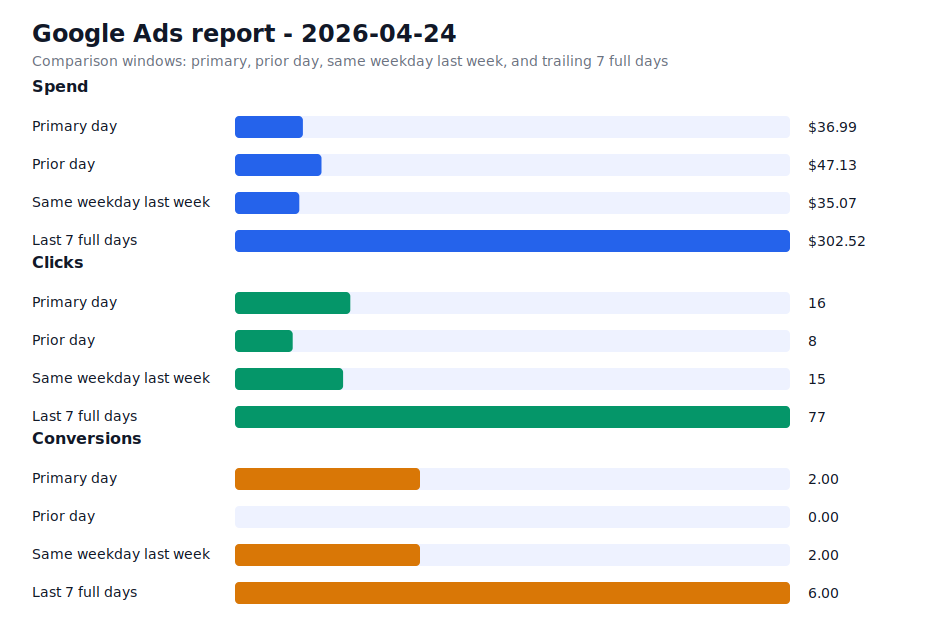

# Daily Ads Report - 2026-04-24

Source: Google Ads API REST via local `.env` credentials
Credential file: `/Users/dax/bomi/bomi-ads/.env`
Generated: 2026-04-25T21:38:27-07:00
Account: Bomi Health, Inc. / `5613091482`
Timezone: America/Los_Angeles
Primary window: 2026-04-24

## Executive Readout

Primary-day spend was $36.99 on 16 clicks and 2.00 conversions, for a blended CPA of $18.49.

## Visual Summary

## Scorecard

| Window | Cost | Impressions | Clicks | CTR | Avg CPC | Conversions | CPA |
| --- | ---: | ---: | ---: | ---: | ---: | ---: | ---: |
| Primary day | $36.99 | 260 | 16 | 6.15% | $2.31 | 2.00 | $18.49 |
| Prior day | $47.13 | 186 | 8 | 4.30% | $5.89 | 0.00 | n/a |
| Same weekday last week | $35.07 | 218 | 15 | 6.88% | $2.34 | 2.00 | $17.54 |
| Last 7 full days | $302.52 | 1,171 | 77 | 6.58% | $3.93 | 6.00 | $50.42 |

## Campaigns

| Campaign | Status | Budget | Cost | Clicks | Impressions | Conversions | CPA |
| --- | --- | ---: | ---: | ---: | ---: | ---: | ---: |
| `General Bomi Leads` | ENABLED | $25.00 | $13.19 | 3 | 24 | 1.00 | $13.19 |
| `schedule meeting` | ENABLED | $15.00 | $23.80 | 13 | 233 | 1.00 | $23.80 |
| `schedule meeting - Indiana 1777010299107` | ENABLED | $15.00 | $0.00 | 0 | 2 | 0.00 | n/a |
| `schedule meeting - New Mexico 1777091221508` | ENABLED | $15.00 | $0.00 | 0 | 0 | 0.00 | n/a |
| `schedule meeting - Ohio 1777010295580` | ENABLED | $15.00 | $0.00 | 0 | 1 | 0.00 | n/a |

## Search Terms

| Campaign | Search term | Cost | Clicks | Impressions | Conversions | CPA |
| --- | --- | ---: | ---: | ---: | ---: | ---: |
| `schedule meeting` | `medical billing solutions` | $8.09 | 3 | 4 | 1.00 | $8.09 |
| `General Bomi Leads` | `care resources provider portal` | $6.34 | 1 | 2 | 0.00 | n/a |
| `schedule meeting` | `medical billing services` | $3.80 | 2 | 3 | 0.00 | n/a |
| `schedule meeting` | `billing company` | $3.09 | 2 | 2 | 0.00 | n/a |
| `schedule meeting` | `how to get credentialed with blue cross blue shield` | $0.00 | 0 | 1 | 0.00 | n/a |
| `schedule meeting` | `medical billing company` | $0.00 | 0 | 2 | 0.00 | n/a |
| `schedule meeting` | `omni medical billing` | $0.00 | 0 | 1 | 0.00 | n/a |
| `General Bomi Leads` | `accubilling` | $0.00 | 0 | 1 | 0.00 | n/a |
| `General Bomi Leads` | `e code solutions` | $0.00 | 0 | 1 | 0.00 | n/a |
| `General Bomi Leads` | `emp claims` | $0.00 | 0 | 1 | 0.00 | n/a |
| `General Bomi Leads` | `expert medical billing` | $0.00 | 0 | 1 | 0.00 | n/a |
| `General Bomi Leads` | `how to get my npi number online` | $0.00 | 0 | 1 | 0.00 | n/a |
| `General Bomi Leads` | `il medicaid provider enrollment` | $0.00 | 0 | 1 | 0.00 | n/a |
| `General Bomi Leads` | `medicaid illinois provider enrollment` | $0.00 | 0 | 1 | 0.00 | n/a |
| `General Bomi Leads` | `medical billing in usa` | $0.00 | 0 | 1 | 0.00 | n/a |
| `General Bomi Leads` | `register for npi number` | $0.00 | 0 | 1 | 0.00 | n/a |
| `General Bomi Leads` | `theraoffice` | $0.00 | 0 | 1 | 0.00 | n/a |
| `General Bomi Leads` | `what is caqh` | $0.00 | 0 | 1 | 0.00 | n/a |
| `schedule meeting - Ohio 1777010295580` | `ohio medicaid credentialing` | $0.00 | 0 | 1 | 0.00 | n/a |

## Notes

- Campaign status in the table is the current API status; metrics are for the selected report window.
- Ohio and Indiana state clone campaigns were created paused, then enabled after review on 2026-04-24.
- New Mexico state clone campaign was created paused, then enabled after landing page deployment on 2026-04-25.
- Slack-ready summary: [2026-04-24 daily ads Slack summary](2026-04-24-daily-ads-slack.md)
- Raw chart URL: https://raw.githubusercontent.com/bomi-ai/bomi-ads/main/reports/2026-04-24-daily-ads-chart.svg
