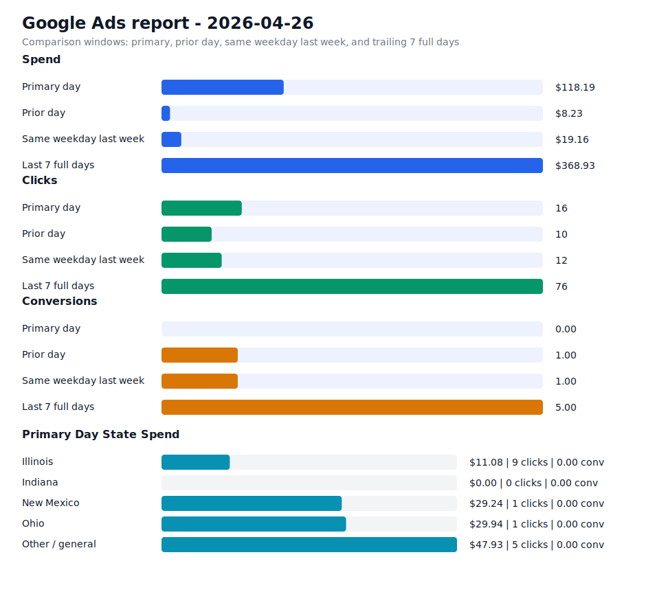

# Daily Ads Report - 2026-04-26

Source: Google Ads API REST via local `.env` credentials
Credential file: `/Users/dax/bomi/bomi-ads/.env`
Generated: 2026-04-27T10:44:55-07:00
Account: Bomi Health, Inc. / `5613091482`
Timezone: America/Los_Angeles
Primary window: 2026-04-26

## Executive Readout

Primary-day spend was $118.19 on 16 clicks and 0.00 conversions, for a blended CPA of n/a.

## Visual Summary

## Scorecard

| Window | Cost | Impressions | Clicks | CTR | Avg CPC | Conversions | CPA |
| --- | ---: | ---: | ---: | ---: | ---: | ---: | ---: |
| Primary day | $118.19 | 265 | 16 | 6.04% | $7.39 | 0.00 | n/a |
| Prior day | $8.23 | 278 | 10 | 3.60% | $0.82 | 1.00 | $8.23 |
| Same weekday last week | $19.16 | 229 | 12 | 5.24% | $1.60 | 1.00 | $19.16 |
| Last 7 full days | $368.93 | 1,389 | 76 | 5.47% | $4.85 | 5.00 | $73.79 |

## State Breakdown

Primary-window campaign metrics grouped by inferred state. Campaigns without a state-specific campaign name are grouped as `Other / general`; the source `schedule meeting` campaign is treated as `Illinois`.

| State | Campaigns | Status | Budget | Cost | Clicks | Impressions | Conversions | CPA |
| --- | ---: | --- | ---: | ---: | ---: | ---: | ---: | ---: |
| Illinois | 1 | ENABLED | $15.00 | $11.08 | 9 | 113 | 0.00 | n/a |
| Indiana | 1 | ENABLED | $15.00 | $0.00 | 0 | 31 | 0.00 | n/a |
| New Mexico | 1 | ENABLED | $15.00 | $29.24 | 1 | 13 | 0.00 | n/a |
| Ohio | 1 | ENABLED | $15.00 | $29.94 | 1 | 52 | 0.00 | n/a |
| Other / general | 1 | ENABLED | $25.00 | $47.93 | 5 | 56 | 0.00 | n/a |

## Campaigns

| Campaign | Status | Budget | Cost | Clicks | Impressions | Conversions | CPA |
| --- | --- | ---: | ---: | ---: | ---: | ---: | ---: |
| `General Bomi Leads` | ENABLED | $25.00 | $47.93 | 5 | 56 | 0.00 | n/a |
| `schedule meeting` | ENABLED | $15.00 | $11.08 | 9 | 113 | 0.00 | n/a |
| `schedule meeting - Indiana 1777010299107` | ENABLED | $15.00 | $0.00 | 0 | 31 | 0.00 | n/a |
| `schedule meeting - New Mexico 1777091221508` | ENABLED | $15.00 | $29.24 | 1 | 13 | 0.00 | n/a |
| `schedule meeting - Ohio 1777010295580` | ENABLED | $15.00 | $29.94 | 1 | 52 | 0.00 | n/a |

## Search Terms

| Campaign | Search term | Cost | Clicks | Impressions | Conversions | CPA |
| --- | --- | ---: | ---: | ---: | ---: | ---: |
| `schedule meeting - Ohio 1777010295580` | `billing` | $29.94 | 1 | 4 | 0.00 | n/a |
| `schedule meeting - New Mexico 1777091221508` | `medical billing new mexico` | $29.24 | 1 | 1 | 0.00 | n/a |
| `General Bomi Leads` | `unitedhealthcare provider portal` | $24.54 | 2 | 2 | 0.00 | n/a |
| `General Bomi Leads` | `unitedhealthcare dual complete provider portal` | $7.93 | 1 | 2 | 0.00 | n/a |
| `schedule meeting` | `medical billing solutions` | $1.24 | 1 | 1 | 0.00 | n/a |
| `schedule meeting` | `outsourced billing and collections` | $1.01 | 1 | 1 | 0.00 | n/a |
| `schedule meeting` | `90832 reimbursement rate` | $0.00 | 0 | 1 | 0.00 | n/a |
| `schedule meeting` | `applying for npi number` | $0.00 | 0 | 1 | 0.00 | n/a |
| `schedule meeting` | `best medical billing software for mental health` | $0.00 | 0 | 1 | 0.00 | n/a |
| `schedule meeting` | `dofr` | $0.00 | 0 | 1 | 0.00 | n/a |
| `schedule meeting` | `healthcare claims processing workflow` | $0.00 | 0 | 1 | 0.00 | n/a |
| `schedule meeting` | `illinois medicaid` | $0.00 | 0 | 1 | 0.00 | n/a |
| `schedule meeting` | `medical billing` | $0.00 | 0 | 1 | 0.00 | n/a |
| `schedule meeting` | `therapy credentialing` | $0.00 | 0 | 1 | 0.00 | n/a |
| `General Bomi Leads` | `credentialing specialists` | $0.00 | 0 | 2 | 0.00 | n/a |
| `General Bomi Leads` | `expert medical billing` | $0.00 | 0 | 3 | 0.00 | n/a |
| `General Bomi Leads` | `get credentialed with medicaid` | $0.00 | 0 | 1 | 0.00 | n/a |
| `General Bomi Leads` | `how do i find out what insurance companies i am credentialed with` | $0.00 | 0 | 2 | 0.00 | n/a |
| `General Bomi Leads` | `how to get an npi number` | $0.00 | 0 | 1 | 0.00 | n/a |
| `General Bomi Leads` | `how to start a billing company from home` | $0.00 | 0 | 1 | 0.00 | n/a |
| `General Bomi Leads` | `humana provider portal` | $0.00 | 0 | 1 | 0.00 | n/a |
| `General Bomi Leads` | `lockbox payment in medical billing` | $0.00 | 0 | 1 | 0.00 | n/a |
| `General Bomi Leads` | `medicaid provider application` | $0.00 | 0 | 1 | 0.00 | n/a |
| `General Bomi Leads` | `medical billing company chicago` | $0.00 | 0 | 1 | 0.00 | n/a |
| `General Bomi Leads` | `npi number` | $0.00 | 0 | 1 | 0.00 | n/a |

## Notes

- Campaign status in the table is the current API status; metrics are for the selected report window.
- State breakdown is inferred from campaign names and the configured source campaign state mapping.
- Ohio and Indiana state clone campaigns were created paused, then enabled after review on 2026-04-24.
- New Mexico state clone campaign was created paused, then enabled after landing page deployment on 2026-04-25.
- Slack-ready summary: [2026-04-26 daily ads Slack summary](2026-04-26-daily-ads-slack.md)
- Raw chart URL: https://raw.githubusercontent.com/bomi-ai/bomi-ads/main/reports/2026-04-26-daily-ads-chart.svg
