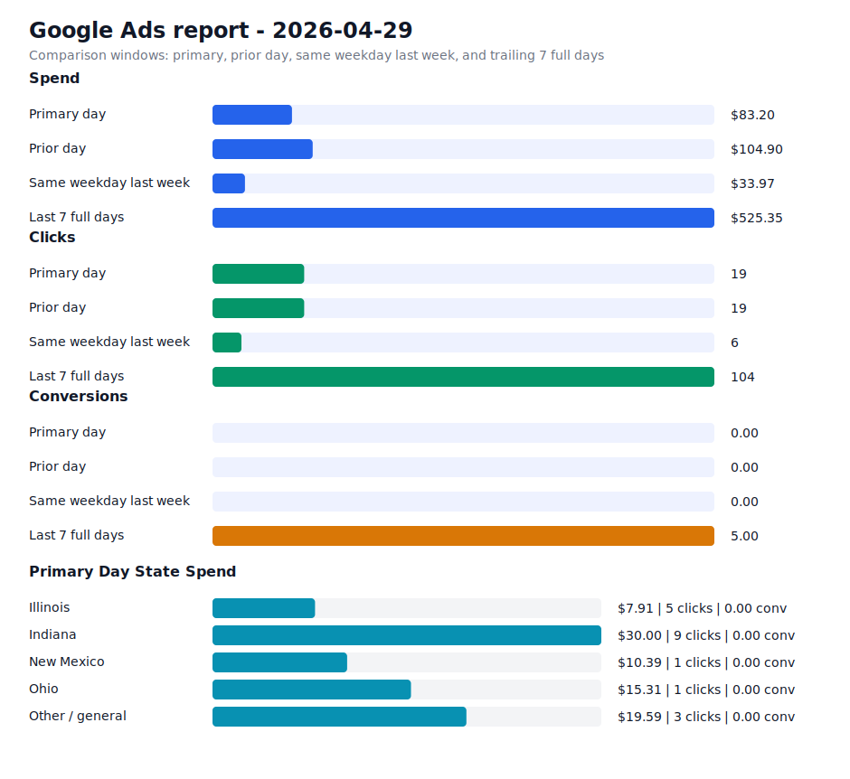

# Daily Ads Report - 2026-04-29

Source: Google Ads API REST via local `.env` credentials
Credential file: `/Users/dax/bomi/bomi-ads/.env`
Generated: 2026-05-09T18:57:02-07:00
Account: Bomi Health, Inc. / `5613091482`
Timezone: America/Los_Angeles
Primary window: 2026-04-29

## Executive Readout

Primary-day spend was $83.20 on 19 clicks and 0.00 conversions, for a blended CPA of n/a.

## Visual Summary

## Scorecard

| Window | Cost | Impressions | Clicks | CTR | Avg CPC | Conversions | CPA |
| --- | ---: | ---: | ---: | ---: | ---: | ---: | ---: |
| Primary day | $83.20 | 1,305 | 19 | 1.46% | $4.38 | 0.00 | n/a |
| Prior day | $104.90 | 840 | 19 | 2.26% | $5.52 | 0.00 | n/a |
| Same weekday last week | $33.97 | 216 | 6 | 2.78% | $5.66 | 0.00 | n/a |
| Last 7 full days | $525.35 | 3,464 | 104 | 3.00% | $5.05 | 5.00 | $105.07 |

## State Breakdown

Primary-window campaign metrics grouped by inferred state. Campaigns without a state-specific campaign name are grouped as `Other / general`; the source `schedule meeting` campaign is treated as `Illinois`.

| State | Campaigns | Status | Budget | Cost | Clicks | Impressions | Conversions | CPA |
| --- | ---: | --- | ---: | ---: | ---: | ---: | ---: | ---: |
| Illinois | 1 | ENABLED | $15.00 | $7.91 | 5 | 58 | 0.00 | n/a |
| Indiana | 1 | ENABLED | $15.00 | $30.00 | 9 | 1,061 | 0.00 | n/a |
| New Mexico | 1 | ENABLED | $15.00 | $10.39 | 1 | 55 | 0.00 | n/a |
| Ohio | 1 | ENABLED | $15.00 | $15.31 | 1 | 4 | 0.00 | n/a |
| Other / general | 1 | ENABLED | $25.00 | $19.59 | 3 | 127 | 0.00 | n/a |

## Campaigns

| Campaign | Status | Budget | Cost | Clicks | Impressions | Conversions | CPA |
| --- | --- | ---: | ---: | ---: | ---: | ---: | ---: |
| `General Bomi Leads` | ENABLED | $25.00 | $19.59 | 3 | 127 | 0.00 | n/a |
| `schedule meeting` | ENABLED | $15.00 | $7.91 | 5 | 58 | 0.00 | n/a |
| `schedule meeting - Indiana 1777010299107` | ENABLED | $15.00 | $30.00 | 9 | 1,061 | 0.00 | n/a |
| `schedule meeting - New Mexico 1777091221508` | ENABLED | $15.00 | $10.39 | 1 | 55 | 0.00 | n/a |
| `schedule meeting - Ohio 1777010295580` | ENABLED | $15.00 | $15.31 | 1 | 4 | 0.00 | n/a |

## Search Terms

| Campaign | Search term | Cost | Clicks | Impressions | Conversions | CPA |
| --- | --- | ---: | ---: | ---: | ---: | ---: |
| `schedule meeting - Ohio 1777010295580` | `billing solutions inc` | $15.31 | 1 | 1 | 0.00 | n/a |
| `General Bomi Leads` | `apply for npi number` | $12.27 | 1 | 2 | 0.00 | n/a |
| `schedule meeting - New Mexico 1777091221508` | `cpt codes for mental health telehealth` | $10.39 | 1 | 1 | 0.00 | n/a |
| `schedule meeting - Indiana 1777010299107` | `billing and reimbursement` | $2.84 | 4 | 5 | 0.00 | n/a |
| `General Bomi Leads` | `1st credentialing reviews` | $0.00 | 0 | 1 | 0.00 | n/a |
| `General Bomi Leads` | `allied benefit systems provider portal` | $0.00 | 0 | 1 | 0.00 | n/a |
| `General Bomi Leads` | `ama insurance provider portal` | $0.00 | 0 | 1 | 0.00 | n/a |
| `General Bomi Leads` | `billing and credentialing specialist` | $0.00 | 0 | 1 | 0.00 | n/a |
| `General Bomi Leads` | `credentialing` | $0.00 | 0 | 1 | 0.00 | n/a |
| `General Bomi Leads` | `credentialing specialist` | $0.00 | 0 | 5 | 0.00 | n/a |
| `General Bomi Leads` | `credex healthcare` | $0.00 | 0 | 2 | 0.00 | n/a |
| `General Bomi Leads` | `expert medical billing` | $0.00 | 0 | 2 | 0.00 | n/a |
| `General Bomi Leads` | `free medical billing software` | $0.00 | 0 | 3 | 0.00 | n/a |
| `General Bomi Leads` | `health plans inc provider portal` | $0.00 | 0 | 1 | 0.00 | n/a |
| `General Bomi Leads` | `how to get credentialed with insurance companies` | $0.00 | 0 | 1 | 0.00 | n/a |
| `General Bomi Leads` | `how to get credentialed with medicare` | $0.00 | 0 | 1 | 0.00 | n/a |
| `General Bomi Leads` | `how to obtain an npi number` | $0.00 | 0 | 1 | 0.00 | n/a |
| `General Bomi Leads` | `https www simplepractice com login` | $0.00 | 0 | 1 | 0.00 | n/a |
| `General Bomi Leads` | `il medicaid provider enrollment` | $0.00 | 0 | 1 | 0.00 | n/a |
| `General Bomi Leads` | `illinois medicaid provider enrollment` | $0.00 | 0 | 2 | 0.00 | n/a |
| `General Bomi Leads` | `imed claims` | $0.00 | 0 | 2 | 0.00 | n/a |
| `General Bomi Leads` | `imedclaims` | $0.00 | 0 | 2 | 0.00 | n/a |
| `General Bomi Leads` | `medicaid illinois provider portal` | $0.00 | 0 | 1 | 0.00 | n/a |
| `General Bomi Leads` | `medicaid of illinois provider portal` | $0.00 | 0 | 1 | 0.00 | n/a |
| `General Bomi Leads` | `medical billing` | $0.00 | 0 | 1 | 0.00 | n/a |

## Notes

- Campaign status in the table is the current API status; metrics are for the selected report window.
- State breakdown is inferred from campaign names and the configured source campaign state mapping.
- Ohio and Indiana state clone campaigns were created paused, then enabled after review on 2026-04-24.
- New Mexico state clone campaign was created paused, then enabled after landing page deployment on 2026-04-25.
- Slack-ready summary: [2026-04-29 daily ads Slack summary](2026-04-29-daily-ads-slack.md)
- Raw chart URL: https://raw.githubusercontent.com/bomi-ai/bomi-ads/main/reports/2026-04-29-daily-ads-chart.svg
