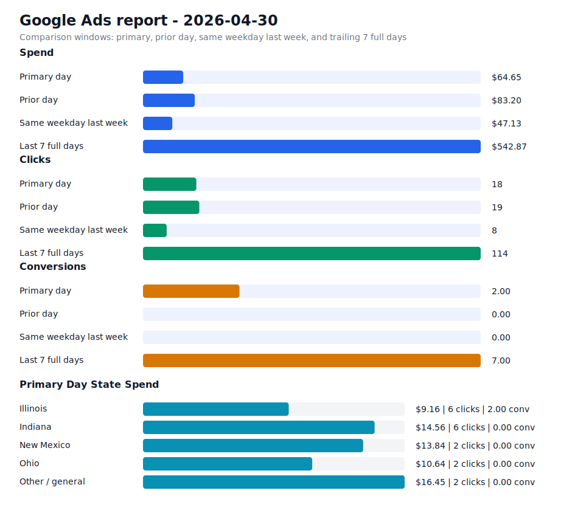

# Daily Ads Report - 2026-04-30

Source: Google Ads API REST via local `.env` credentials
Credential file: `/Users/dax/bomi/bomi-ads/.env`
Generated: 2026-05-09T18:57:09-07:00
Account: Bomi Health, Inc. / `5613091482`
Timezone: America/Los_Angeles
Primary window: 2026-04-30

## Executive Readout

Primary-day spend was $64.65 on 18 clicks and 2.00 conversions, for a blended CPA of $32.33.

## Visual Summary

## Scorecard

| Window | Cost | Impressions | Clicks | CTR | Avg CPC | Conversions | CPA |
| --- | ---: | ---: | ---: | ---: | ---: | ---: | ---: |
| Primary day | $64.65 | 1,551 | 18 | 1.16% | $3.59 | 2.00 | $32.33 |
| Prior day | $83.20 | 1,305 | 19 | 1.46% | $4.38 | 0.00 | n/a |
| Same weekday last week | $47.13 | 186 | 8 | 4.30% | $5.89 | 0.00 | n/a |
| Last 7 full days | $542.87 | 4,829 | 114 | 2.36% | $4.76 | 7.00 | $77.55 |

## State Breakdown

Primary-window campaign metrics grouped by inferred state. Campaigns without a state-specific campaign name are grouped as `Other / general`; the source `schedule meeting` campaign is treated as `Illinois`.

| State | Campaigns | Status | Budget | Cost | Clicks | Impressions | Conversions | CPA |
| --- | ---: | --- | ---: | ---: | ---: | ---: | ---: | ---: |
| Illinois | 1 | ENABLED | $15.00 | $9.16 | 6 | 116 | 2.00 | $4.58 |
| Indiana | 1 | ENABLED | $15.00 | $14.56 | 6 | 1,300 | 0.00 | n/a |
| New Mexico | 1 | ENABLED | $15.00 | $13.84 | 2 | 51 | 0.00 | n/a |
| Ohio | 1 | ENABLED | $15.00 | $10.64 | 2 | 54 | 0.00 | n/a |
| Other / general | 1 | ENABLED | $25.00 | $16.45 | 2 | 30 | 0.00 | n/a |

## Campaigns

| Campaign | Status | Budget | Cost | Clicks | Impressions | Conversions | CPA |
| --- | --- | ---: | ---: | ---: | ---: | ---: | ---: |
| `General Bomi Leads` | ENABLED | $25.00 | $16.45 | 2 | 30 | 0.00 | n/a |
| `schedule meeting` | ENABLED | $15.00 | $9.16 | 6 | 116 | 2.00 | $4.58 |
| `schedule meeting - Indiana 1777010299107` | ENABLED | $15.00 | $14.56 | 6 | 1,300 | 0.00 | n/a |
| `schedule meeting - New Mexico 1777091221508` | ENABLED | $15.00 | $13.84 | 2 | 51 | 0.00 | n/a |
| `schedule meeting - Ohio 1777010295580` | ENABLED | $15.00 | $10.64 | 2 | 54 | 0.00 | n/a |

## Search Terms

| Campaign | Search term | Cost | Clicks | Impressions | Conversions | CPA |
| --- | --- | ---: | ---: | ---: | ---: | ---: |
| `schedule meeting - New Mexico 1777091221508` | `ncred` | $11.79 | 1 | 1 | 0.00 | n/a |
| `schedule meeting - Indiana 1777010299107` | `billing and reimbursement` | $2.98 | 3 | 5 | 0.00 | n/a |
| `schedule meeting - New Mexico 1777091221508` | `billing and reimbursement` | $2.05 | 1 | 1 | 0.00 | n/a |
| `schedule meeting - Ohio 1777010295580` | `billing and reimbursement` | $1.30 | 1 | 2 | 0.00 | n/a |
| `schedule meeting` | `provider enrollment and credentialing services` | $0.00 | 0 | 1 | 0.00 | n/a |
| `General Bomi Leads` | `billing` | $0.00 | 0 | 1 | 0.00 | n/a |
| `General Bomi Leads` | `credentialing` | $0.00 | 0 | 1 | 0.00 | n/a |
| `General Bomi Leads` | `how to get in network with insurance` | $0.00 | 0 | 2 | 0.00 | n/a |
| `General Bomi Leads` | `imed claims` | $0.00 | 0 | 1 | 0.00 | n/a |
| `General Bomi Leads` | `imedclaims` | $0.00 | 0 | 1 | 0.00 | n/a |
| `General Bomi Leads` | `medicaid credentialing for providers` | $0.00 | 0 | 1 | 0.00 | n/a |
| `General Bomi Leads` | `medicaid of illinois provider portal` | $0.00 | 0 | 1 | 0.00 | n/a |
| `General Bomi Leads` | `medical billing company in chicago` | $0.00 | 0 | 1 | 0.00 | n/a |
| `General Bomi Leads` | `medical invoice generator` | $0.00 | 0 | 1 | 0.00 | n/a |
| `General Bomi Leads` | `pecos account` | $0.00 | 0 | 1 | 0.00 | n/a |
| `General Bomi Leads` | `simple practice` | $0.00 | 0 | 1 | 0.00 | n/a |
| `General Bomi Leads` | `spectrum billing solutions` | $0.00 | 0 | 1 | 0.00 | n/a |
| `General Bomi Leads` | `uhcprovider com` | $0.00 | 0 | 1 | 0.00 | n/a |
| `schedule meeting - Ohio 1777010295580` | `adelfi medical billing solutions` | $0.00 | 0 | 2 | 0.00 | n/a |
| `schedule meeting - Ohio 1777010295580` | `behavioral health billing solutions` | $0.00 | 0 | 1 | 0.00 | n/a |
| `schedule meeting - Ohio 1777010295580` | `behavioral health medical billing` | $0.00 | 0 | 1 | 0.00 | n/a |
| `schedule meeting - Ohio 1777010295580` | `cincinnati medical billing services` | $0.00 | 0 | 2 | 0.00 | n/a |
| `schedule meeting - Ohio 1777010295580` | `cpt code 90791` | $0.00 | 0 | 1 | 0.00 | n/a |
| `schedule meeting - Ohio 1777010295580` | `everest vision denial scenarios` | $0.00 | 0 | 1 | 0.00 | n/a |
| `schedule meeting - Ohio 1777010295580` | `hbs medicaid` | $0.00 | 0 | 1 | 0.00 | n/a |

## Notes

- Campaign status in the table is the current API status; metrics are for the selected report window.
- State breakdown is inferred from campaign names and the configured source campaign state mapping.
- Ohio and Indiana state clone campaigns were created paused, then enabled after review on 2026-04-24.
- New Mexico state clone campaign was created paused, then enabled after landing page deployment on 2026-04-25.
- Slack-ready summary: [2026-04-30 daily ads Slack summary](2026-04-30-daily-ads-slack.md)
- Raw chart URL: https://raw.githubusercontent.com/bomi-ai/bomi-ads/main/reports/2026-04-30-daily-ads-chart.svg
