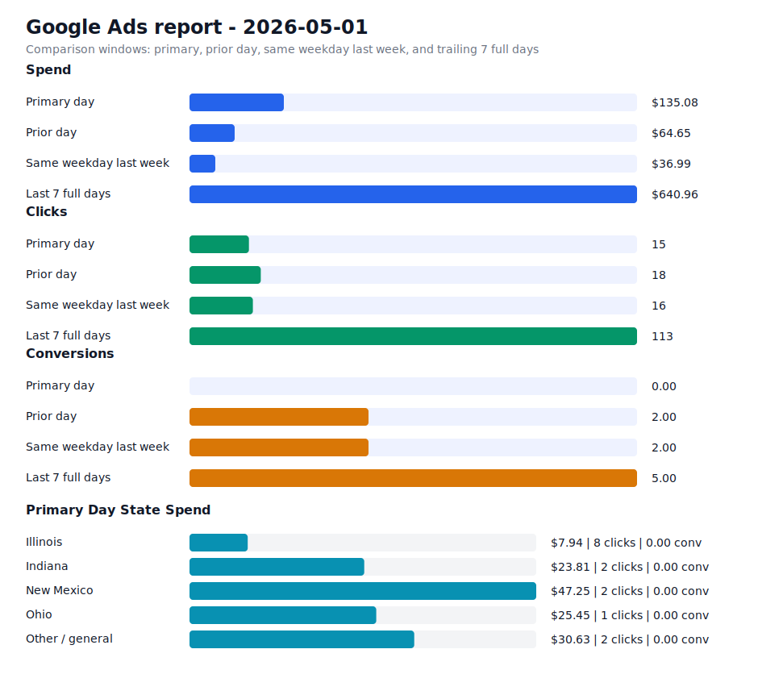

# Daily Ads Report - 2026-05-01

Source: Google Ads API REST via local `.env` credentials
Credential file: `/Users/dax/bomi/bomi-ads/.env`
Generated: 2026-05-09T18:57:16-07:00
Account: Bomi Health, Inc. / `5613091482`
Timezone: America/Los_Angeles
Primary window: 2026-05-01

## Executive Readout

Primary-day spend was $135.08 on 15 clicks and 0.00 conversions, for a blended CPA of n/a.

## Visual Summary

## Scorecard

| Window | Cost | Impressions | Clicks | CTR | Avg CPC | Conversions | CPA |
| --- | ---: | ---: | ---: | ---: | ---: | ---: | ---: |
| Primary day | $135.08 | 558 | 15 | 2.69% | $9.01 | 0.00 | n/a |
| Prior day | $64.65 | 1,551 | 18 | 1.16% | $3.59 | 2.00 | $32.33 |
| Same weekday last week | $36.99 | 260 | 16 | 6.15% | $2.31 | 2.00 | $18.49 |
| Last 7 full days | $640.96 | 5,127 | 113 | 2.20% | $5.67 | 5.00 | $128.19 |

## State Breakdown

Primary-window campaign metrics grouped by inferred state. Campaigns without a state-specific campaign name are grouped as `Other / general`; the source `schedule meeting` campaign is treated as `Illinois`.

| State | Campaigns | Status | Budget | Cost | Clicks | Impressions | Conversions | CPA |
| --- | ---: | --- | ---: | ---: | ---: | ---: | ---: | ---: |
| Illinois | 1 | ENABLED | $15.00 | $7.94 | 8 | 224 | 0.00 | n/a |
| Indiana | 1 | ENABLED | $15.00 | $23.81 | 2 | 261 | 0.00 | n/a |
| New Mexico | 1 | ENABLED | $15.00 | $47.25 | 2 | 20 | 0.00 | n/a |
| Ohio | 1 | ENABLED | $15.00 | $25.45 | 1 | 1 | 0.00 | n/a |
| Other / general | 1 | ENABLED | $25.00 | $30.63 | 2 | 52 | 0.00 | n/a |

## Campaigns

| Campaign | Status | Budget | Cost | Clicks | Impressions | Conversions | CPA |
| --- | --- | ---: | ---: | ---: | ---: | ---: | ---: |
| `General Bomi Leads` | ENABLED | $25.00 | $30.63 | 2 | 52 | 0.00 | n/a |
| `schedule meeting` | ENABLED | $15.00 | $7.94 | 8 | 224 | 0.00 | n/a |
| `schedule meeting - Indiana 1777010299107` | ENABLED | $15.00 | $23.81 | 2 | 261 | 0.00 | n/a |
| `schedule meeting - New Mexico 1777091221508` | ENABLED | $15.00 | $47.25 | 2 | 20 | 0.00 | n/a |
| `schedule meeting - Ohio 1777010295580` | ENABLED | $15.00 | $25.45 | 1 | 1 | 0.00 | n/a |

## Search Terms

| Campaign | Search term | Cost | Clicks | Impressions | Conversions | CPA |
| --- | --- | ---: | ---: | ---: | ---: | ---: |
| `schedule meeting - Indiana 1777010299107` | `how to become credentialed with medicaid` | $22.30 | 1 | 1 | 0.00 | n/a |
| `schedule meeting - Indiana 1777010299107` | `credentialing application` | $1.51 | 1 | 1 | 0.00 | n/a |
| `General Bomi Leads` | `apply for npi` | $0.00 | 0 | 1 | 0.00 | n/a |
| `General Bomi Leads` | `credentialing in medical billing` | $0.00 | 0 | 1 | 0.00 | n/a |
| `General Bomi Leads` | `credentialing specialists` | $0.00 | 0 | 1 | 0.00 | n/a |
| `General Bomi Leads` | `first health provider portal eligibility` | $0.00 | 0 | 2 | 0.00 | n/a |
| `General Bomi Leads` | `hfs w9 impact illinois gov` | $0.00 | 0 | 1 | 0.00 | n/a |
| `General Bomi Leads` | `ncci edits lookup` | $0.00 | 0 | 1 | 0.00 | n/a |
| `General Bomi Leads` | `nppes apply for npi` | $0.00 | 0 | 1 | 0.00 | n/a |
| `General Bomi Leads` | `pecos enrollment` | $0.00 | 0 | 2 | 0.00 | n/a |
| `General Bomi Leads` | `therabill login` | $0.00 | 0 | 2 | 0.00 | n/a |
| `General Bomi Leads` | `uhcprovider com` | $0.00 | 0 | 1 | 0.00 | n/a |
| `schedule meeting - New Mexico 1777091221508` | `90834` | $0.00 | 0 | 1 | 0.00 | n/a |
| `schedule meeting - New Mexico 1777091221508` | `home health coding and billing` | $0.00 | 0 | 1 | 0.00 | n/a |
| `schedule meeting - New Mexico 1777091221508` | `list of type of bill codes` | $0.00 | 0 | 2 | 0.00 | n/a |
| `schedule meeting - New Mexico 1777091221508` | `nppes` | $0.00 | 0 | 1 | 0.00 | n/a |
| `schedule meeting - New Mexico 1777091221508` | `simple practice` | $0.00 | 0 | 1 | 0.00 | n/a |
| `schedule meeting - New Mexico 1777091221508` | `simplepractice` | $0.00 | 0 | 1 | 0.00 | n/a |
| `schedule meeting - New Mexico 1777091221508` | `therapy documentation` | $0.00 | 0 | 1 | 0.00 | n/a |
| `schedule meeting - Indiana 1777010299107` | `billing service` | $0.00 | 0 | 1 | 0.00 | n/a |
| `schedule meeting - Indiana 1777010299107` | `blessed billing credentialing and consulting llc` | $0.00 | 0 | 1 | 0.00 | n/a |
| `schedule meeting - Indiana 1777010299107` | `cpt 90837` | $0.00 | 0 | 1 | 0.00 | n/a |
| `schedule meeting - Indiana 1777010299107` | `credentialing` | $0.00 | 0 | 1 | 0.00 | n/a |
| `schedule meeting - Indiana 1777010299107` | `how to write therapy progress notes` | $0.00 | 0 | 2 | 0.00 | n/a |
| `schedule meeting - Indiana 1777010299107` | `insurance billing training` | $0.00 | 0 | 1 | 0.00 | n/a |

## Notes

- Campaign status in the table is the current API status; metrics are for the selected report window.
- State breakdown is inferred from campaign names and the configured source campaign state mapping.
- Ohio and Indiana state clone campaigns were created paused, then enabled after review on 2026-04-24.
- New Mexico state clone campaign was created paused, then enabled after landing page deployment on 2026-04-25.
- Slack-ready summary: [2026-05-01 daily ads Slack summary](2026-05-01-daily-ads-slack.md)
- Raw chart URL: https://raw.githubusercontent.com/bomi-ai/bomi-ads/main/reports/2026-05-01-daily-ads-chart.svg
