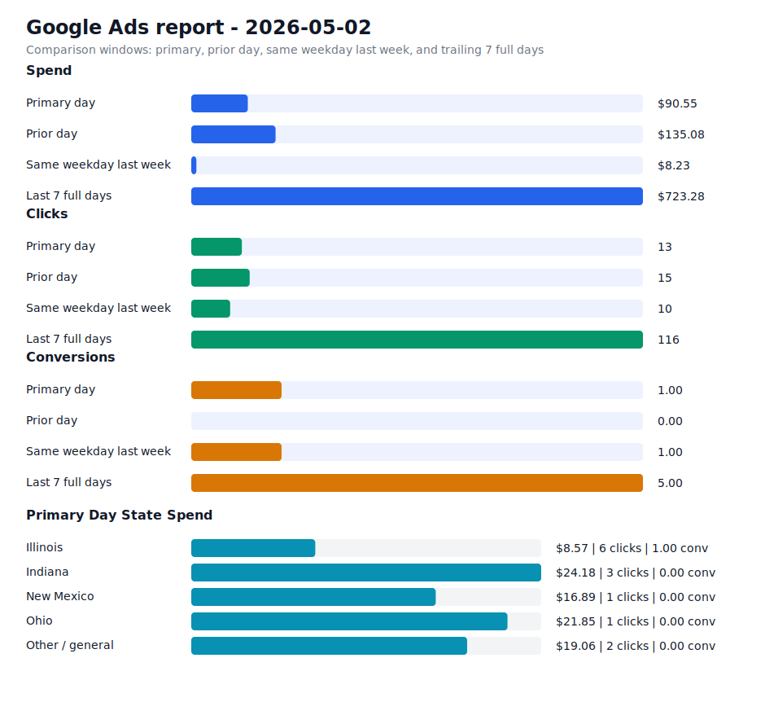

# Daily Ads Report - 2026-05-02

Source: Google Ads API REST via local `.env` credentials
Credential file: `/Users/dax/bomi/bomi-ads/.env`
Generated: 2026-05-09T18:57:23-07:00
Account: Bomi Health, Inc. / `5613091482`
Timezone: America/Los_Angeles
Primary window: 2026-05-02

## Executive Readout

Primary-day spend was $90.55 on 13 clicks and 1.00 conversions, for a blended CPA of $90.55.

## Visual Summary

## Scorecard

| Window | Cost | Impressions | Clicks | CTR | Avg CPC | Conversions | CPA |
| --- | ---: | ---: | ---: | ---: | ---: | ---: | ---: |
| Primary day | $90.55 | 476 | 13 | 2.73% | $6.97 | 1.00 | $90.55 |
| Prior day | $135.08 | 558 | 15 | 2.69% | $9.01 | 0.00 | n/a |
| Same weekday last week | $8.23 | 278 | 10 | 3.60% | $0.82 | 1.00 | $8.23 |
| Last 7 full days | $723.28 | 5,325 | 116 | 2.18% | $6.24 | 5.00 | $144.66 |

## State Breakdown

Primary-window campaign metrics grouped by inferred state. Campaigns without a state-specific campaign name are grouped as `Other / general`; the source `schedule meeting` campaign is treated as `Illinois`.

| State | Campaigns | Status | Budget | Cost | Clicks | Impressions | Conversions | CPA |
| --- | ---: | --- | ---: | ---: | ---: | ---: | ---: | ---: |
| Illinois | 1 | ENABLED | $15.00 | $8.57 | 6 | 36 | 1.00 | $8.57 |
| Indiana | 1 | ENABLED | $15.00 | $24.18 | 3 | 350 | 0.00 | n/a |
| New Mexico | 1 | ENABLED | $15.00 | $16.89 | 1 | 49 | 0.00 | n/a |
| Ohio | 1 | ENABLED | $15.00 | $21.85 | 1 | 22 | 0.00 | n/a |
| Other / general | 1 | ENABLED | $25.00 | $19.06 | 2 | 19 | 0.00 | n/a |

## Campaigns

| Campaign | Status | Budget | Cost | Clicks | Impressions | Conversions | CPA |
| --- | --- | ---: | ---: | ---: | ---: | ---: | ---: |
| `General Bomi Leads` | ENABLED | $25.00 | $19.06 | 2 | 19 | 0.00 | n/a |
| `schedule meeting` | ENABLED | $15.00 | $8.57 | 6 | 36 | 1.00 | $8.57 |
| `schedule meeting - Indiana 1777010299107` | ENABLED | $15.00 | $24.18 | 3 | 350 | 0.00 | n/a |
| `schedule meeting - New Mexico 1777091221508` | ENABLED | $15.00 | $16.89 | 1 | 49 | 0.00 | n/a |
| `schedule meeting - Ohio 1777010295580` | ENABLED | $15.00 | $21.85 | 1 | 22 | 0.00 | n/a |

## Search Terms

| Campaign | Search term | Cost | Clicks | Impressions | Conversions | CPA |
| --- | --- | ---: | ---: | ---: | ---: | ---: |
| `schedule meeting - Ohio 1777010295580` | `simplepractice pricing` | $21.85 | 1 | 1 | 0.00 | n/a |
| `schedule meeting - Indiana 1777010299107` | `billing` | $16.39 | 1 | 1 | 0.00 | n/a |
| `General Bomi Leads` | `billing` | $9.21 | 1 | 2 | 0.00 | n/a |
| `schedule meeting - Indiana 1777010299107` | `add on codes for psychotherapy` | $6.69 | 1 | 1 | 0.00 | n/a |
| `schedule meeting - Indiana 1777010299107` | `billing and reimbursement` | $1.10 | 1 | 1 | 0.00 | n/a |
| `schedule meeting` | `cloud based practice management software` | $0.00 | 0 | 1 | 0.00 | n/a |
| `schedule meeting` | `medical claims processing companies` | $0.00 | 0 | 1 | 0.00 | n/a |
| `General Bomi Leads` | `acbilling` | $0.00 | 0 | 2 | 0.00 | n/a |
| `General Bomi Leads` | `credentialing` | $0.00 | 0 | 2 | 0.00 | n/a |
| `General Bomi Leads` | `expert medical billing` | $0.00 | 0 | 2 | 0.00 | n/a |
| `General Bomi Leads` | `how to get on insurance panels` | $0.00 | 0 | 1 | 0.00 | n/a |
| `General Bomi Leads` | `imed claims` | $0.00 | 0 | 2 | 0.00 | n/a |
| `General Bomi Leads` | `insurance credentialing` | $0.00 | 0 | 1 | 0.00 | n/a |
| `schedule meeting - Ohio 1777010295580` | `aetna behavioral health credentialing` | $0.00 | 0 | 1 | 0.00 | n/a |
| `schedule meeting - Ohio 1777010295580` | `medical codes for billing` | $0.00 | 0 | 1 | 0.00 | n/a |
| `schedule meeting - Ohio 1777010295580` | `ohio medicaid provider enrollment application` | $0.00 | 0 | 1 | 0.00 | n/a |
| `schedule meeting - Ohio 1777010295580` | `simple practice` | $0.00 | 0 | 1 | 0.00 | n/a |
| `schedule meeting - Ohio 1777010295580` | `what is provider enrollment and credentialing` | $0.00 | 0 | 1 | 0.00 | n/a |
| `schedule meeting - New Mexico 1777091221508` | `30 minute therapy cpt code` | $0.00 | 0 | 1 | 0.00 | n/a |
| `schedule meeting - New Mexico 1777091221508` | `caqh attestation login` | $0.00 | 0 | 1 | 0.00 | n/a |
| `schedule meeting - New Mexico 1777091221508` | `get credentialed with medicaid` | $0.00 | 0 | 2 | 0.00 | n/a |
| `schedule meeting - New Mexico 1777091221508` | `pecos certification` | $0.00 | 0 | 4 | 0.00 | n/a |
| `schedule meeting - New Mexico 1777091221508` | `physician credentialing services` | $0.00 | 0 | 1 | 0.00 | n/a |
| `schedule meeting - New Mexico 1777091221508` | `practice better` | $0.00 | 0 | 1 | 0.00 | n/a |
| `schedule meeting - New Mexico 1777091221508` | `simple practice` | $0.00 | 0 | 3 | 0.00 | n/a |

## Notes

- Campaign status in the table is the current API status; metrics are for the selected report window.
- State breakdown is inferred from campaign names and the configured source campaign state mapping.
- Ohio and Indiana state clone campaigns were created paused, then enabled after review on 2026-04-24.
- New Mexico state clone campaign was created paused, then enabled after landing page deployment on 2026-04-25.
- Slack-ready summary: [2026-05-02 daily ads Slack summary](2026-05-02-daily-ads-slack.md)
- Raw chart URL: https://raw.githubusercontent.com/bomi-ai/bomi-ads/main/reports/2026-05-02-daily-ads-chart.svg
