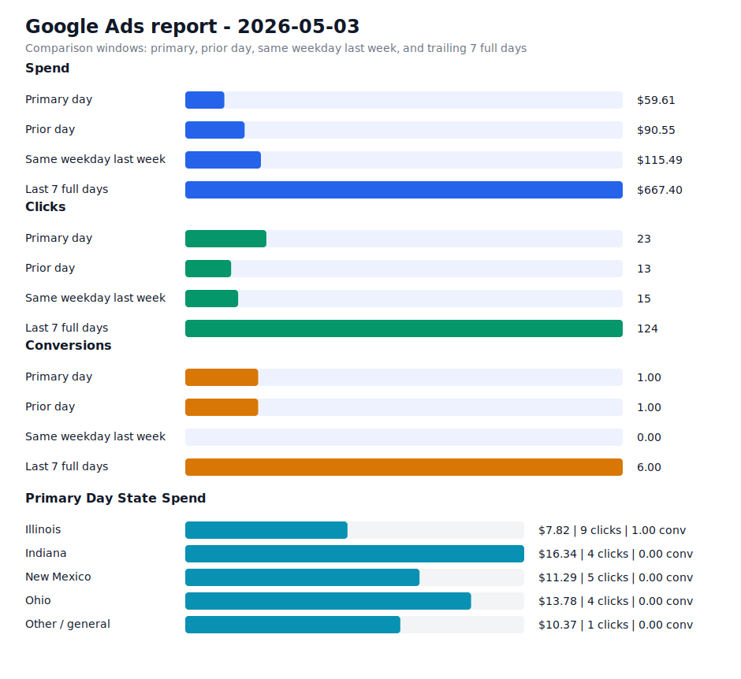

# Daily Ads Report - 2026-05-03

Source: Google Ads API REST via local `.env` credentials
Credential file: `/Users/dax/bomi/bomi-ads/.env`
Generated: 2026-05-09T18:57:29-07:00
Account: Bomi Health, Inc. / `5613091482`
Timezone: America/Los_Angeles
Primary window: 2026-05-03

## Executive Readout

Primary-day spend was $59.61 on 23 clicks and 1.00 conversions, for a blended CPA of $59.61.

## Visual Summary

## Scorecard

| Window | Cost | Impressions | Clicks | CTR | Avg CPC | Conversions | CPA |
| --- | ---: | ---: | ---: | ---: | ---: | ---: | ---: |
| Primary day | $59.61 | 1,354 | 23 | 1.70% | $2.59 | 1.00 | $59.61 |
| Prior day | $90.55 | 476 | 13 | 2.73% | $6.97 | 1.00 | $90.55 |
| Same weekday last week | $115.49 | 256 | 15 | 5.86% | $7.70 | 0.00 | n/a |
| Last 7 full days | $667.40 | 6,423 | 124 | 1.93% | $5.38 | 6.00 | $111.23 |

## State Breakdown

Primary-window campaign metrics grouped by inferred state. Campaigns without a state-specific campaign name are grouped as `Other / general`; the source `schedule meeting` campaign is treated as `Illinois`.

| State | Campaigns | Status | Budget | Cost | Clicks | Impressions | Conversions | CPA |
| --- | ---: | --- | ---: | ---: | ---: | ---: | ---: | ---: |
| Illinois | 1 | ENABLED | $15.00 | $7.82 | 9 | 83 | 1.00 | $7.82 |
| Indiana | 1 | ENABLED | $15.00 | $16.34 | 4 | 387 | 0.00 | n/a |
| New Mexico | 1 | ENABLED | $15.00 | $11.29 | 5 | 838 | 0.00 | n/a |
| Ohio | 1 | ENABLED | $15.00 | $13.78 | 4 | 22 | 0.00 | n/a |
| Other / general | 1 | ENABLED | $25.00 | $10.37 | 1 | 24 | 0.00 | n/a |

## Campaigns

| Campaign | Status | Budget | Cost | Clicks | Impressions | Conversions | CPA |
| --- | --- | ---: | ---: | ---: | ---: | ---: | ---: |
| `General Bomi Leads` | ENABLED | $25.00 | $10.37 | 1 | 24 | 0.00 | n/a |
| `schedule meeting` | ENABLED | $15.00 | $7.82 | 9 | 83 | 1.00 | $7.82 |
| `schedule meeting - Indiana 1777010299107` | ENABLED | $15.00 | $16.34 | 4 | 387 | 0.00 | n/a |
| `schedule meeting - New Mexico 1777091221508` | ENABLED | $15.00 | $11.29 | 5 | 838 | 0.00 | n/a |
| `schedule meeting - Ohio 1777010295580` | ENABLED | $15.00 | $13.78 | 4 | 22 | 0.00 | n/a |

## Search Terms

| Campaign | Search term | Cost | Clicks | Impressions | Conversions | CPA |
| --- | --- | ---: | ---: | ---: | ---: | ---: |
| `schedule meeting - Ohio 1777010295580` | `revenue cycle management healthcare` | $9.33 | 2 | 2 | 0.00 | n/a |
| `schedule meeting - Ohio 1777010295580` | `healthcare revenue cycle management` | $2.38 | 1 | 2 | 0.00 | n/a |
| `General Bomi Leads` | `billing service quotes` | $0.00 | 0 | 1 | 0.00 | n/a |
| `General Bomi Leads` | `create an npi number` | $0.00 | 0 | 2 | 0.00 | n/a |
| `General Bomi Leads` | `denial codes in medical billing pdf` | $0.00 | 0 | 1 | 0.00 | n/a |
| `General Bomi Leads` | `gateway billing services` | $0.00 | 0 | 1 | 0.00 | n/a |
| `General Bomi Leads` | `insurance credentialing near me` | $0.00 | 0 | 2 | 0.00 | n/a |
| `General Bomi Leads` | `m l medical billing` | $0.00 | 0 | 1 | 0.00 | n/a |
| `General Bomi Leads` | `medicare chiropractic billing guide` | $0.00 | 0 | 1 | 0.00 | n/a |
| `General Bomi Leads` | `npi number how to get one` | $0.00 | 0 | 1 | 0.00 | n/a |
| `schedule meeting - Ohio 1777010295580` | `ask the biller` | $0.00 | 0 | 1 | 0.00 | n/a |
| `schedule meeting - Ohio 1777010295580` | `how to get a medicaid provider id number` | $0.00 | 0 | 2 | 0.00 | n/a |
| `schedule meeting - Ohio 1777010295580` | `ohio medicaid provider enrollment` | $0.00 | 0 | 1 | 0.00 | n/a |
| `schedule meeting - New Mexico 1777091221508` | `behavioral health billing specialist` | $0.00 | 0 | 1 | 0.00 | n/a |
| `schedule meeting - New Mexico 1777091221508` | `credentialing services for providers` | $0.00 | 0 | 1 | 0.00 | n/a |
| `schedule meeting - New Mexico 1777091221508` | `electronic medical billing` | $0.00 | 0 | 2 | 0.00 | n/a |
| `schedule meeting - New Mexico 1777091221508` | `get credentialed with medicaid` | $0.00 | 0 | 6 | 0.00 | n/a |
| `schedule meeting - New Mexico 1777091221508` | `how to start an outpatient mental health clinic` | $0.00 | 0 | 1 | 0.00 | n/a |
| `schedule meeting - New Mexico 1777091221508` | `insurance billing codes for mental health` | $0.00 | 0 | 2 | 0.00 | n/a |
| `schedule meeting - New Mexico 1777091221508` | `medallion credentialing` | $0.00 | 0 | 1 | 0.00 | n/a |
| `schedule meeting - New Mexico 1777091221508` | `medical billing services` | $0.00 | 0 | 1 | 0.00 | n/a |
| `schedule meeting - New Mexico 1777091221508` | `what is availity` | $0.00 | 0 | 1 | 0.00 | n/a |
| `schedule meeting - Indiana 1777010299107` | `billing and reimbursement` | $0.00 | 0 | 1 | 0.00 | n/a |
| `schedule meeting - Indiana 1777010299107` | `medical billing` | $0.00 | 0 | 1 | 0.00 | n/a |
| `schedule meeting - Indiana 1777010299107` | `medical billing service` | $0.00 | 0 | 1 | 0.00 | n/a |

## Notes

- Campaign status in the table is the current API status; metrics are for the selected report window.
- State breakdown is inferred from campaign names and the configured source campaign state mapping.
- Ohio and Indiana state clone campaigns were created paused, then enabled after review on 2026-04-24.
- New Mexico state clone campaign was created paused, then enabled after landing page deployment on 2026-04-25.
- Slack-ready summary: [2026-05-03 daily ads Slack summary](2026-05-03-daily-ads-slack.md)
- Raw chart URL: https://raw.githubusercontent.com/bomi-ai/bomi-ads/main/reports/2026-05-03-daily-ads-chart.svg
