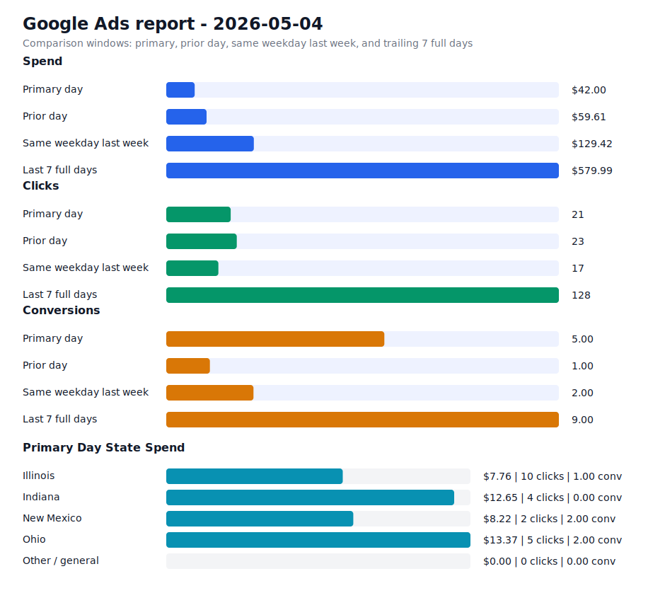

# Daily Ads Report - 2026-05-04

Source: Google Ads API REST via local `.env` credentials
Credential file: `/Users/dax/bomi/bomi-ads/.env`
Generated: 2026-05-09T18:57:36-07:00
Account: Bomi Health, Inc. / `5613091482`
Timezone: America/Los_Angeles
Primary window: 2026-05-04

## Executive Readout

Primary-day spend was $42.00 on 21 clicks and 5.00 conversions, for a blended CPA of $8.40.

## Visual Summary

## Scorecard

| Window | Cost | Impressions | Clicks | CTR | Avg CPC | Conversions | CPA |
| --- | ---: | ---: | ---: | ---: | ---: | ---: | ---: |
| Primary day | $42.00 | 1,456 | 21 | 1.44% | $2.00 | 5.00 | $8.40 |
| Prior day | $59.61 | 1,354 | 23 | 1.70% | $2.59 | 1.00 | $59.61 |
| Same weekday last week | $129.42 | 339 | 17 | 5.01% | $7.61 | 2.00 | $64.71 |
| Last 7 full days | $579.99 | 7,540 | 128 | 1.70% | $4.53 | 9.00 | $64.44 |

## State Breakdown

Primary-window campaign metrics grouped by inferred state. Campaigns without a state-specific campaign name are grouped as `Other / general`; the source `schedule meeting` campaign is treated as `Illinois`.

| State | Campaigns | Status | Budget | Cost | Clicks | Impressions | Conversions | CPA |
| --- | ---: | --- | ---: | ---: | ---: | ---: | ---: | ---: |
| Illinois | 1 | ENABLED | $15.00 | $7.76 | 10 | 117 | 1.00 | $7.76 |
| Indiana | 1 | ENABLED | $15.00 | $12.65 | 4 | 956 | 0.00 | n/a |
| New Mexico | 1 | ENABLED | $15.00 | $8.22 | 2 | 311 | 2.00 | $4.11 |
| Ohio | 1 | ENABLED | $15.00 | $13.37 | 5 | 30 | 2.00 | $6.68 |
| Other / general | 1 | ENABLED | $25.00 | $0.00 | 0 | 42 | 0.00 | n/a |

## Campaigns

| Campaign | Status | Budget | Cost | Clicks | Impressions | Conversions | CPA |
| --- | --- | ---: | ---: | ---: | ---: | ---: | ---: |
| `General Bomi Leads` | ENABLED | $25.00 | $0.00 | 0 | 42 | 0.00 | n/a |
| `schedule meeting` | ENABLED | $15.00 | $7.76 | 10 | 117 | 1.00 | $7.76 |
| `schedule meeting - Indiana 1777010299107` | ENABLED | $15.00 | $12.65 | 4 | 956 | 0.00 | n/a |
| `schedule meeting - New Mexico 1777091221508` | ENABLED | $15.00 | $8.22 | 2 | 311 | 2.00 | $4.11 |
| `schedule meeting - Ohio 1777010295580` | ENABLED | $15.00 | $13.37 | 5 | 30 | 2.00 | $6.68 |

## Search Terms

| Campaign | Search term | Cost | Clicks | Impressions | Conversions | CPA |
| --- | --- | ---: | ---: | ---: | ---: | ---: |
| `schedule meeting - Ohio 1777010295580` | `revenue cycle management` | $4.13 | 1 | 1 | 0.00 | n/a |
| `schedule meeting - Ohio 1777010295580` | `healthcare revenue cycle management` | $3.47 | 1 | 1 | 2.00 | $1.74 |
| `schedule meeting - Ohio 1777010295580` | `billing and reimbursement` | $3.42 | 2 | 2 | 0.00 | n/a |
| `schedule meeting - Ohio 1777010295580` | `practice management software` | $2.35 | 1 | 1 | 0.00 | n/a |
| `schedule meeting` | `private pay therapy practice` | $0.00 | 0 | 1 | 0.00 | n/a |
| `General Bomi Leads` | `administrative concepts provider portal` | $0.00 | 0 | 1 | 0.00 | n/a |
| `General Bomi Leads` | `consociate health provider portal` | $0.00 | 0 | 1 | 0.00 | n/a |
| `General Bomi Leads` | `does simple practice do credentialing` | $0.00 | 0 | 1 | 0.00 | n/a |
| `General Bomi Leads` | `expert medical billing` | $0.00 | 0 | 1 | 0.00 | n/a |
| `General Bomi Leads` | `illinois provider portal` | $0.00 | 0 | 2 | 0.00 | n/a |
| `General Bomi Leads` | `impact provider enrollment` | $0.00 | 0 | 1 | 0.00 | n/a |
| `General Bomi Leads` | `insurance credentialing companies` | $0.00 | 0 | 1 | 0.00 | n/a |
| `General Bomi Leads` | `medical billing in illinois` | $0.00 | 0 | 2 | 0.00 | n/a |
| `General Bomi Leads` | `medical billing service chicago` | $0.00 | 0 | 2 | 0.00 | n/a |
| `General Bomi Leads` | `npi` | $0.00 | 0 | 1 | 0.00 | n/a |
| `General Bomi Leads` | `nppes npi registry hhs gov` | $0.00 | 0 | 2 | 0.00 | n/a |
| `General Bomi Leads` | `obc billing` | $0.00 | 0 | 1 | 0.00 | n/a |
| `General Bomi Leads` | `resilience billing` | $0.00 | 0 | 2 | 0.00 | n/a |
| `General Bomi Leads` | `simple practice free credentialing` | $0.00 | 0 | 2 | 0.00 | n/a |
| `schedule meeting - Ohio 1777010295580` | `medical billing` | $0.00 | 0 | 1 | 0.00 | n/a |
| `schedule meeting - Ohio 1777010295580` | `national provider identifier npi` | $0.00 | 0 | 1 | 0.00 | n/a |
| `schedule meeting - Ohio 1777010295580` | `payer credentialing process` | $0.00 | 0 | 2 | 0.00 | n/a |
| `schedule meeting - Ohio 1777010295580` | `the insurance panel` | $0.00 | 0 | 1 | 0.00 | n/a |
| `schedule meeting - New Mexico 1777091221508` | `billing and reimbursement` | $0.00 | 0 | 1 | 0.00 | n/a |
| `schedule meeting - New Mexico 1777091221508` | `medical billing` | $0.00 | 0 | 1 | 0.00 | n/a |

## Notes

- Campaign status in the table is the current API status; metrics are for the selected report window.
- State breakdown is inferred from campaign names and the configured source campaign state mapping.
- Ohio and Indiana state clone campaigns were created paused, then enabled after review on 2026-04-24.
- New Mexico state clone campaign was created paused, then enabled after landing page deployment on 2026-04-25.
- Slack-ready summary: [2026-05-04 daily ads Slack summary](2026-05-04-daily-ads-slack.md)
- Raw chart URL: https://raw.githubusercontent.com/bomi-ai/bomi-ads/main/reports/2026-05-04-daily-ads-chart.svg
