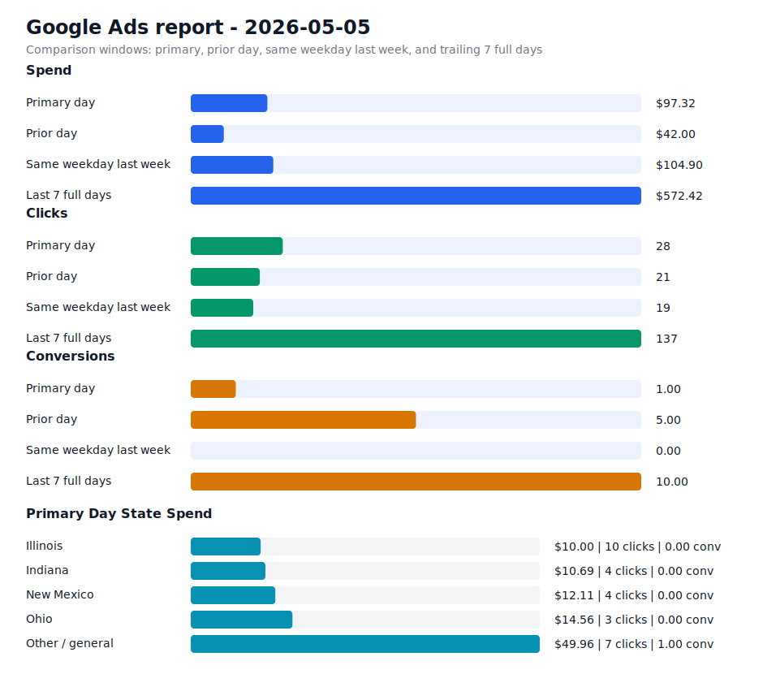

# Daily Ads Report - 2026-05-05

Source: Google Ads API REST via local `.env` credentials
Credential file: `/Users/dax/bomi/bomi-ads/.env`
Generated: 2026-05-09T18:57:42-07:00
Account: Bomi Health, Inc. / `5613091482`
Timezone: America/Los_Angeles
Primary window: 2026-05-05

## Executive Readout

Primary-day spend was $97.32 on 28 clicks and 1.00 conversions, for a blended CPA of $97.32.

## Visual Summary

## Scorecard

| Window | Cost | Impressions | Clicks | CTR | Avg CPC | Conversions | CPA |
| --- | ---: | ---: | ---: | ---: | ---: | ---: | ---: |
| Primary day | $97.32 | 2,169 | 28 | 1.29% | $3.48 | 1.00 | $97.32 |
| Prior day | $42.00 | 1,456 | 21 | 1.44% | $2.00 | 5.00 | $8.40 |
| Same weekday last week | $104.90 | 840 | 19 | 2.26% | $5.52 | 0.00 | n/a |
| Last 7 full days | $572.42 | 8,869 | 137 | 1.54% | $4.18 | 10.00 | $57.24 |

## State Breakdown

Primary-window campaign metrics grouped by inferred state. Campaigns without a state-specific campaign name are grouped as `Other / general`; the source `schedule meeting` campaign is treated as `Illinois`.

| State | Campaigns | Status | Budget | Cost | Clicks | Impressions | Conversions | CPA |
| --- | ---: | --- | ---: | ---: | ---: | ---: | ---: | ---: |
| Illinois | 1 | ENABLED | $15.00 | $10.00 | 10 | 176 | 0.00 | n/a |
| Indiana | 1 | ENABLED | $15.00 | $10.69 | 4 | 1,774 | 0.00 | n/a |
| New Mexico | 1 | ENABLED | $15.00 | $12.11 | 4 | 75 | 0.00 | n/a |
| Ohio | 1 | ENABLED | $15.00 | $14.56 | 3 | 65 | 0.00 | n/a |
| Other / general | 1 | ENABLED | $25.00 | $49.96 | 7 | 79 | 1.00 | $49.96 |

## Campaigns

| Campaign | Status | Budget | Cost | Clicks | Impressions | Conversions | CPA |
| --- | --- | ---: | ---: | ---: | ---: | ---: | ---: |
| `General Bomi Leads` | ENABLED | $25.00 | $49.96 | 7 | 79 | 1.00 | $49.96 |
| `schedule meeting` | ENABLED | $15.00 | $10.00 | 10 | 176 | 0.00 | n/a |
| `schedule meeting - Indiana 1777010299107` | ENABLED | $15.00 | $10.69 | 4 | 1,774 | 0.00 | n/a |
| `schedule meeting - New Mexico 1777091221508` | ENABLED | $15.00 | $12.11 | 4 | 75 | 0.00 | n/a |
| `schedule meeting - Ohio 1777010295580` | ENABLED | $15.00 | $14.56 | 3 | 65 | 0.00 | n/a |

## Search Terms

| Campaign | Search term | Cost | Clicks | Impressions | Conversions | CPA |
| --- | --- | ---: | ---: | ---: | ---: | ---: |
| `General Bomi Leads` | `webtpa provider portal` | $5.13 | 1 | 2 | 0.00 | n/a |
| `schedule meeting - New Mexico 1777091221508` | `mental health billing` | $3.58 | 1 | 1 | 0.00 | n/a |
| `General Bomi Leads` | `3won` | $0.00 | 0 | 2 | 0.00 | n/a |
| `General Bomi Leads` | `caqh login` | $0.00 | 0 | 1 | 0.00 | n/a |
| `General Bomi Leads` | `client portal simple practice` | $0.00 | 0 | 1 | 0.00 | n/a |
| `General Bomi Leads` | `cms application process` | $0.00 | 0 | 2 | 0.00 | n/a |
| `General Bomi Leads` | `consociate health provider portal` | $0.00 | 0 | 1 | 0.00 | n/a |
| `General Bomi Leads` | `credentialing` | $0.00 | 0 | 1 | 0.00 | n/a |
| `General Bomi Leads` | `credentialing specialist` | $0.00 | 0 | 1 | 0.00 | n/a |
| `General Bomi Leads` | `healthcare billing services` | $0.00 | 0 | 2 | 0.00 | n/a |
| `General Bomi Leads` | `healthcare common procedure coding system hcpcs` | $0.00 | 0 | 1 | 0.00 | n/a |
| `General Bomi Leads` | `how to check medicaid eligibility for providers` | $0.00 | 0 | 1 | 0.00 | n/a |
| `General Bomi Leads` | `illinois medicare provider portal` | $0.00 | 0 | 2 | 0.00 | n/a |
| `General Bomi Leads` | `imed claims` | $0.00 | 0 | 2 | 0.00 | n/a |
| `General Bomi Leads` | `imedclaims` | $0.00 | 0 | 1 | 0.00 | n/a |
| `General Bomi Leads` | `medical billing` | $0.00 | 0 | 1 | 0.00 | n/a |
| `General Bomi Leads` | `medical billing services` | $0.00 | 0 | 4 | 0.00 | n/a |
| `General Bomi Leads` | `medical billing services illinois` | $0.00 | 0 | 3 | 0.00 | n/a |
| `General Bomi Leads` | `physician credentialing specialist` | $0.00 | 0 | 1 | 0.00 | n/a |
| `General Bomi Leads` | `resilience billing` | $0.00 | 0 | 1 | 0.00 | n/a |
| `schedule meeting - Ohio 1777010295580` | `billing and reimbursement` | $0.00 | 0 | 5 | 0.00 | n/a |
| `schedule meeting - Ohio 1777010295580` | `billing code` | $0.00 | 0 | 2 | 0.00 | n/a |
| `schedule meeting - Ohio 1777010295580` | `incident to billing mental health` | $0.00 | 0 | 1 | 0.00 | n/a |
| `schedule meeting - Ohio 1777010295580` | `medical billing` | $0.00 | 0 | 2 | 0.00 | n/a |
| `schedule meeting - Ohio 1777010295580` | `revspring inc` | $0.00 | 0 | 1 | 0.00 | n/a |

## Notes

- Campaign status in the table is the current API status; metrics are for the selected report window.
- State breakdown is inferred from campaign names and the configured source campaign state mapping.
- Ohio and Indiana state clone campaigns were created paused, then enabled after review on 2026-04-24.
- New Mexico state clone campaign was created paused, then enabled after landing page deployment on 2026-04-25.
- Slack-ready summary: [2026-05-05 daily ads Slack summary](2026-05-05-daily-ads-slack.md)
- Raw chart URL: https://raw.githubusercontent.com/bomi-ai/bomi-ads/main/reports/2026-05-05-daily-ads-chart.svg
