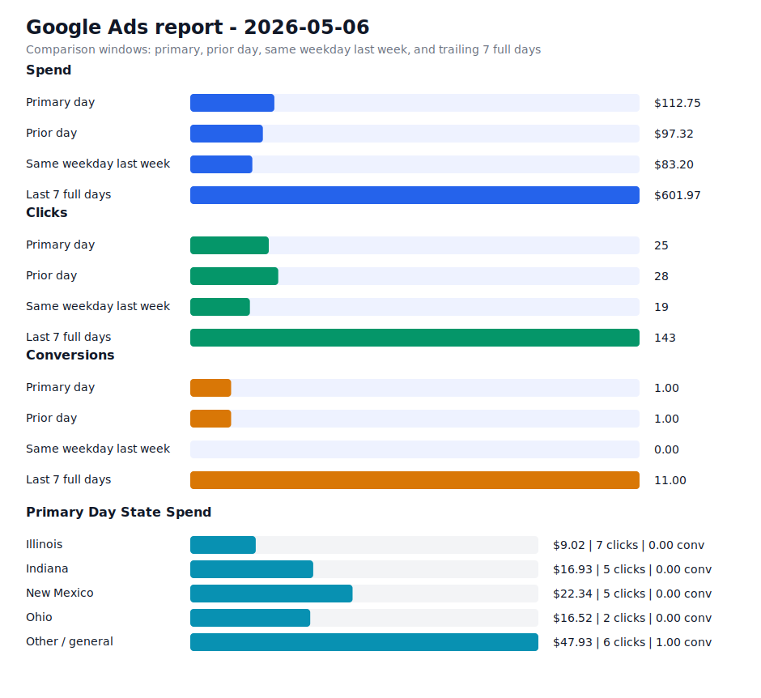

# Daily Ads Report - 2026-05-06

Source: Google Ads API REST via local `.env` credentials
Credential file: `/Users/dax/bomi/bomi-ads/.env`
Generated: 2026-05-09T18:57:48-07:00
Account: Bomi Health, Inc. / `5613091482`
Timezone: America/Los_Angeles
Primary window: 2026-05-06

## Executive Readout

Primary-day spend was $112.75 on 25 clicks and 1.00 conversions, for a blended CPA of $112.75.

## Visual Summary

## Scorecard

| Window | Cost | Impressions | Clicks | CTR | Avg CPC | Conversions | CPA |
| --- | ---: | ---: | ---: | ---: | ---: | ---: | ---: |
| Primary day | $112.75 | 1,652 | 25 | 1.51% | $4.51 | 1.00 | $112.75 |
| Prior day | $97.32 | 2,169 | 28 | 1.29% | $3.48 | 1.00 | $97.32 |
| Same weekday last week | $83.20 | 1,305 | 19 | 1.46% | $4.38 | 0.00 | n/a |
| Last 7 full days | $601.97 | 9,216 | 143 | 1.55% | $4.21 | 11.00 | $54.72 |

## State Breakdown

Primary-window campaign metrics grouped by inferred state. Campaigns without a state-specific campaign name are grouped as `Other / general`; the source `schedule meeting` campaign is treated as `Illinois`.

| State | Campaigns | Status | Budget | Cost | Clicks | Impressions | Conversions | CPA |
| --- | ---: | --- | ---: | ---: | ---: | ---: | ---: | ---: |
| Illinois | 1 | ENABLED | $15.00 | $9.02 | 7 | 38 | 0.00 | n/a |
| Indiana | 1 | ENABLED | $15.00 | $16.93 | 5 | 671 | 0.00 | n/a |
| New Mexico | 1 | ENABLED | $15.00 | $22.34 | 5 | 633 | 0.00 | n/a |
| Ohio | 1 | ENABLED | $15.00 | $16.52 | 2 | 202 | 0.00 | n/a |
| Other / general | 1 | ENABLED | $25.00 | $47.93 | 6 | 108 | 1.00 | $47.93 |

## Campaigns

| Campaign | Status | Budget | Cost | Clicks | Impressions | Conversions | CPA |
| --- | --- | ---: | ---: | ---: | ---: | ---: | ---: |
| `General Bomi Leads` | ENABLED | $25.00 | $47.93 | 6 | 108 | 1.00 | $47.93 |
| `schedule meeting` | ENABLED | $15.00 | $9.02 | 7 | 38 | 0.00 | n/a |
| `schedule meeting - Indiana 1777010299107` | ENABLED | $15.00 | $16.93 | 5 | 671 | 0.00 | n/a |
| `schedule meeting - New Mexico 1777091221508` | ENABLED | $15.00 | $22.34 | 5 | 633 | 0.00 | n/a |
| `schedule meeting - Ohio 1777010295580` | ENABLED | $15.00 | $16.52 | 2 | 202 | 0.00 | n/a |

## Search Terms

| Campaign | Search term | Cost | Clicks | Impressions | Conversions | CPA |
| --- | --- | ---: | ---: | ---: | ---: | ---: |
| `General Bomi Leads` | `how to become medicaid certified` | $7.15 | 1 | 2 | 1.00 | $7.15 |
| `schedule meeting - Indiana 1777010299107` | `billing and reimbursement` | $3.10 | 1 | 1 | 0.00 | n/a |
| `General Bomi Leads` | `billing and credentialing specialist` | $0.00 | 0 | 1 | 0.00 | n/a |
| `General Bomi Leads` | `credentialing` | $0.00 | 0 | 1 | 0.00 | n/a |
| `General Bomi Leads` | `expert medical billing` | $0.00 | 0 | 3 | 0.00 | n/a |
| `General Bomi Leads` | `g2211 cpt code` | $0.00 | 0 | 1 | 0.00 | n/a |
| `General Bomi Leads` | `homestate provider portal` | $0.00 | 0 | 1 | 0.00 | n/a |
| `General Bomi Leads` | `how to credential a provider with insurance companies` | $0.00 | 0 | 2 | 0.00 | n/a |
| `General Bomi Leads` | `how to get paneled with insurance as a therapist` | $0.00 | 0 | 1 | 0.00 | n/a |
| `General Bomi Leads` | `illinois medicaid billing guidelines` | $0.00 | 0 | 2 | 0.00 | n/a |
| `General Bomi Leads` | `illinois medicaid billing manual` | $0.00 | 0 | 1 | 0.00 | n/a |
| `General Bomi Leads` | `illinois medicare provider portal` | $0.00 | 0 | 1 | 0.00 | n/a |
| `General Bomi Leads` | `medallion provider credentialing` | $0.00 | 0 | 1 | 0.00 | n/a |
| `General Bomi Leads` | `medical billing` | $0.00 | 0 | 2 | 0.00 | n/a |
| `General Bomi Leads` | `medical billing services in illinois` | $0.00 | 0 | 1 | 0.00 | n/a |
| `General Bomi Leads` | `netsource billing` | $0.00 | 0 | 1 | 0.00 | n/a |
| `General Bomi Leads` | `quantum medical billing` | $0.00 | 0 | 2 | 0.00 | n/a |
| `General Bomi Leads` | `resilience billing` | $0.00 | 0 | 1 | 0.00 | n/a |
| `General Bomi Leads` | `therapist calculator` | $0.00 | 0 | 1 | 0.00 | n/a |
| `schedule meeting - Ohio 1777010295580` | `management services network llc` | $0.00 | 0 | 1 | 0.00 | n/a |
| `schedule meeting - Ohio 1777010295580` | `npi number application` | $0.00 | 0 | 3 | 0.00 | n/a |
| `schedule meeting - New Mexico 1777091221508` | `90847 cpt code` | $0.00 | 0 | 2 | 0.00 | n/a |
| `schedule meeting - New Mexico 1777091221508` | `credentialing with cigna behavioral health` | $0.00 | 0 | 1 | 0.00 | n/a |
| `schedule meeting - New Mexico 1777091221508` | `how do i get a caqh provider number` | $0.00 | 0 | 2 | 0.00 | n/a |
| `schedule meeting - New Mexico 1777091221508` | `how to get an npi` | $0.00 | 0 | 1 | 0.00 | n/a |

## Notes

- Campaign status in the table is the current API status; metrics are for the selected report window.
- State breakdown is inferred from campaign names and the configured source campaign state mapping.
- Ohio and Indiana state clone campaigns were created paused, then enabled after review on 2026-04-24.
- New Mexico state clone campaign was created paused, then enabled after landing page deployment on 2026-04-25.
- Slack-ready summary: [2026-05-06 daily ads Slack summary](2026-05-06-daily-ads-slack.md)
- Raw chart URL: https://raw.githubusercontent.com/bomi-ai/bomi-ads/main/reports/2026-05-06-daily-ads-chart.svg
