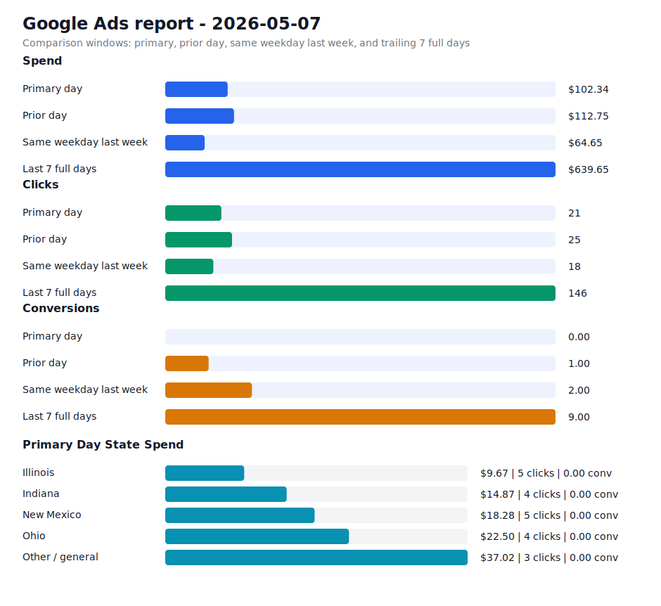

# Daily Ads Report - 2026-05-07

Source: Google Ads API REST via local `.env` credentials
Credential file: `/Users/dax/bomi/bomi-ads/.env`
Generated: 2026-05-09T18:57:54-07:00
Account: Bomi Health, Inc. / `5613091482`
Timezone: America/Los_Angeles
Primary window: 2026-05-07

## Executive Readout

Primary-day spend was $102.34 on 21 clicks and 0.00 conversions, for a blended CPA of n/a.

## Visual Summary

## Scorecard

| Window | Cost | Impressions | Clicks | CTR | Avg CPC | Conversions | CPA |
| --- | ---: | ---: | ---: | ---: | ---: | ---: | ---: |
| Primary day | $102.34 | 2,431 | 21 | 0.86% | $4.87 | 0.00 | n/a |
| Prior day | $112.75 | 1,652 | 25 | 1.51% | $4.51 | 1.00 | $112.75 |
| Same weekday last week | $64.65 | 1,551 | 18 | 1.16% | $3.59 | 2.00 | $32.33 |
| Last 7 full days | $639.65 | 10,096 | 146 | 1.45% | $4.38 | 9.00 | $71.07 |

## State Breakdown

Primary-window campaign metrics grouped by inferred state. Campaigns without a state-specific campaign name are grouped as `Other / general`; the source `schedule meeting` campaign is treated as `Illinois`.

| State | Campaigns | Status | Budget | Cost | Clicks | Impressions | Conversions | CPA |
| --- | ---: | --- | ---: | ---: | ---: | ---: | ---: | ---: |
| Illinois | 1 | ENABLED | $15.00 | $9.67 | 5 | 320 | 0.00 | n/a |
| Indiana | 1 | ENABLED | $15.00 | $14.87 | 4 | 1,569 | 0.00 | n/a |
| New Mexico | 1 | ENABLED | $15.00 | $18.28 | 5 | 492 | 0.00 | n/a |
| Ohio | 1 | ENABLED | $15.00 | $22.50 | 4 | 26 | 0.00 | n/a |
| Other / general | 1 | ENABLED | $25.00 | $37.02 | 3 | 24 | 0.00 | n/a |

## Campaigns

| Campaign | Status | Budget | Cost | Clicks | Impressions | Conversions | CPA |
| --- | --- | ---: | ---: | ---: | ---: | ---: | ---: |
| `General Bomi Leads` | ENABLED | $25.00 | $37.02 | 3 | 24 | 0.00 | n/a |
| `schedule meeting` | ENABLED | $15.00 | $9.67 | 5 | 320 | 0.00 | n/a |
| `schedule meeting - Indiana 1777010299107` | ENABLED | $15.00 | $14.87 | 4 | 1,569 | 0.00 | n/a |
| `schedule meeting - New Mexico 1777091221508` | ENABLED | $15.00 | $18.28 | 5 | 492 | 0.00 | n/a |
| `schedule meeting - Ohio 1777010295580` | ENABLED | $15.00 | $22.50 | 4 | 26 | 0.00 | n/a |

## Search Terms

| Campaign | Search term | Cost | Clicks | Impressions | Conversions | CPA |
| --- | --- | ---: | ---: | ---: | ---: | ---: |
| `schedule meeting - Ohio 1777010295580` | `ohio department of medicaid provider` | $18.08 | 2 | 1 | 0.00 | n/a |
| `schedule meeting - New Mexico 1777091221508` | `insurance verification tools` | $7.14 | 1 | 1 | 0.00 | n/a |
| `schedule meeting - Indiana 1777010299107` | `how to get paneled with insurance` | $6.83 | 1 | 1 | 0.00 | n/a |
| `General Bomi Leads` | `theraoffice` | $4.18 | 1 | 2 | 0.00 | n/a |
| `schedule meeting - Ohio 1777010295580` | `healthcare revenue cycle management` | $2.72 | 1 | 1 | 0.00 | n/a |
| `schedule meeting - New Mexico 1777091221508` | `healthcare software` | $2.54 | 1 | 1 | 0.00 | n/a |
| `schedule meeting - Ohio 1777010295580` | `revenue cycle management healthcare` | $1.70 | 1 | 1 | 0.00 | n/a |
| `schedule meeting` | `medical billing outsourcing companies in usa` | $0.00 | 0 | 1 | 0.00 | n/a |
| `General Bomi Leads` | `billing for counseling services` | $0.00 | 0 | 1 | 0.00 | n/a |
| `General Bomi Leads` | `emp claims` | $0.00 | 0 | 1 | 0.00 | n/a |
| `General Bomi Leads` | `expert medical billing` | $0.00 | 0 | 1 | 0.00 | n/a |
| `General Bomi Leads` | `how to apply for npi number` | $0.00 | 0 | 1 | 0.00 | n/a |
| `General Bomi Leads` | `medicaid credentialing` | $0.00 | 0 | 1 | 0.00 | n/a |
| `General Bomi Leads` | `medical billing services in illinois` | $0.00 | 0 | 3 | 0.00 | n/a |
| `General Bomi Leads` | `medicare of illinois provider portal` | $0.00 | 0 | 1 | 0.00 | n/a |
| `General Bomi Leads` | `medicare provider credentialing` | $0.00 | 0 | 1 | 0.00 | n/a |
| `General Bomi Leads` | `vault admin services provider portal` | $0.00 | 0 | 1 | 0.00 | n/a |
| `schedule meeting - Ohio 1777010295580` | `billing and coding` | $0.00 | 0 | 1 | 0.00 | n/a |
| `schedule meeting - Ohio 1777010295580` | `how to become a provider for aetna insurance` | $0.00 | 0 | 1 | 0.00 | n/a |
| `schedule meeting - Ohio 1777010295580` | `provider credentialing checklist template excel` | $0.00 | 0 | 1 | 0.00 | n/a |
| `schedule meeting - New Mexico 1777091221508` | `caqh` | $0.00 | 0 | 1 | 0.00 | n/a |
| `schedule meeting - New Mexico 1777091221508` | `how does caqh work` | $0.00 | 0 | 1 | 0.00 | n/a |
| `schedule meeting - New Mexico 1777091221508` | `how to contract with medicaid` | $0.00 | 0 | 1 | 0.00 | n/a |
| `schedule meeting - New Mexico 1777091221508` | `soap notes` | $0.00 | 0 | 1 | 0.00 | n/a |
| `schedule meeting - Indiana 1777010299107` | `aapc` | $0.00 | 0 | 1 | 0.00 | n/a |

## Notes

- Campaign status in the table is the current API status; metrics are for the selected report window.
- State breakdown is inferred from campaign names and the configured source campaign state mapping.
- Ohio and Indiana state clone campaigns were created paused, then enabled after review on 2026-04-24.
- New Mexico state clone campaign was created paused, then enabled after landing page deployment on 2026-04-25.
- Slack-ready summary: [2026-05-07 daily ads Slack summary](2026-05-07-daily-ads-slack.md)
- Raw chart URL: https://raw.githubusercontent.com/bomi-ai/bomi-ads/main/reports/2026-05-07-daily-ads-chart.svg
