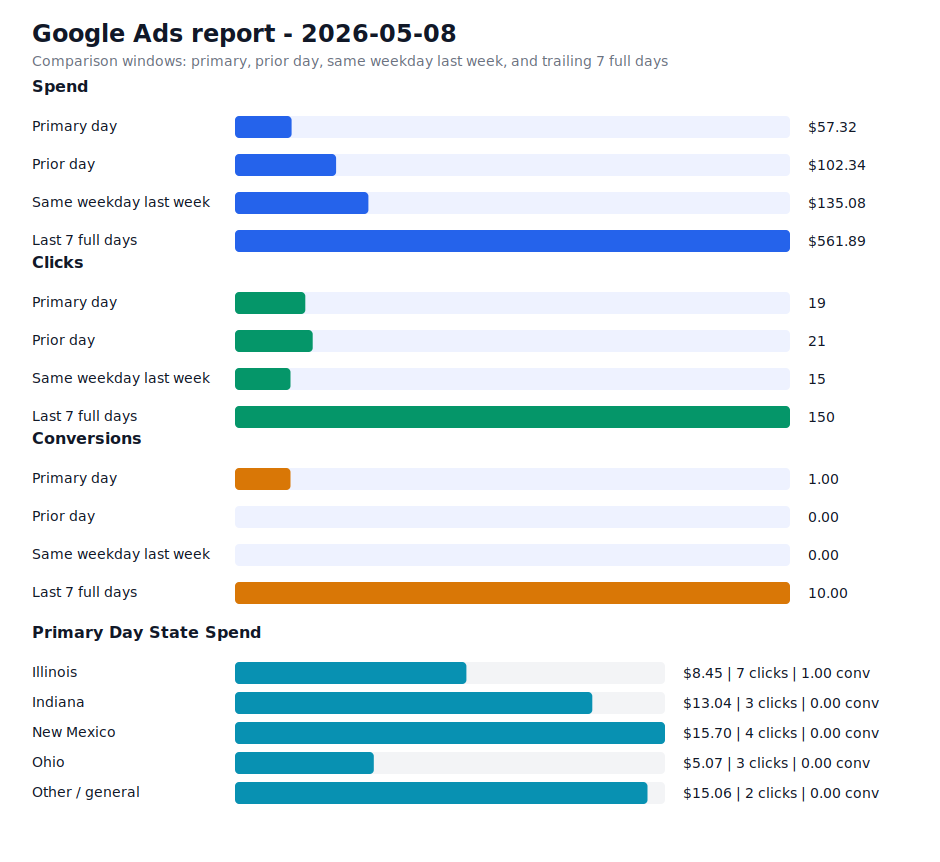

# Daily Ads Report - 2026-05-08

Source: Google Ads API REST via local `.env` credentials
Credential file: `/Users/dax/bomi/bomi-ads/.env`
Generated: 2026-05-09T18:56:15-07:00
Account: Bomi Health, Inc. / `5613091482`
Timezone: America/Los_Angeles
Primary window: 2026-05-08

## Executive Readout

Primary-day spend was $57.32 on 19 clicks and 1.00 conversions, for a blended CPA of $57.32.

## Visual Summary

## Scorecard

| Window | Cost | Impressions | Clicks | CTR | Avg CPC | Conversions | CPA |
| --- | ---: | ---: | ---: | ---: | ---: | ---: | ---: |
| Primary day | $57.32 | 1,753 | 19 | 1.08% | $3.02 | 1.00 | $57.32 |
| Prior day | $102.34 | 2,431 | 21 | 0.86% | $4.87 | 0.00 | n/a |
| Same weekday last week | $135.08 | 558 | 15 | 2.69% | $9.01 | 0.00 | n/a |
| Last 7 full days | $561.89 | 11,291 | 150 | 1.33% | $3.75 | 10.00 | $56.19 |

## State Breakdown

Primary-window campaign metrics grouped by inferred state. Campaigns without a state-specific campaign name are grouped as `Other / general`; the source `schedule meeting` campaign is treated as `Illinois`.

| State | Campaigns | Status | Budget | Cost | Clicks | Impressions | Conversions | CPA |
| --- | ---: | --- | ---: | ---: | ---: | ---: | ---: | ---: |
| Illinois | 1 | ENABLED | $15.00 | $8.45 | 7 | 347 | 1.00 | $8.45 |
| Indiana | 1 | ENABLED | $15.00 | $13.04 | 3 | 834 | 0.00 | n/a |
| New Mexico | 1 | ENABLED | $15.00 | $15.70 | 4 | 226 | 0.00 | n/a |
| Ohio | 1 | ENABLED | $15.00 | $5.07 | 3 | 304 | 0.00 | n/a |
| Other / general | 1 | ENABLED | $25.00 | $15.06 | 2 | 42 | 0.00 | n/a |

## Campaigns

| Campaign | Status | Budget | Cost | Clicks | Impressions | Conversions | CPA |
| --- | --- | ---: | ---: | ---: | ---: | ---: | ---: |
| `General Bomi Leads` | ENABLED | $25.00 | $15.06 | 2 | 42 | 0.00 | n/a |
| `schedule meeting` | ENABLED | $15.00 | $8.45 | 7 | 347 | 1.00 | $8.45 |
| `schedule meeting - Indiana 1777010299107` | ENABLED | $15.00 | $13.04 | 3 | 834 | 0.00 | n/a |
| `schedule meeting - New Mexico 1777091221508` | ENABLED | $15.00 | $15.70 | 4 | 226 | 0.00 | n/a |
| `schedule meeting - Ohio 1777010295580` | ENABLED | $15.00 | $5.07 | 3 | 304 | 0.00 | n/a |

## Search Terms

| Campaign | Search term | Cost | Clicks | Impressions | Conversions | CPA |
| --- | --- | ---: | ---: | ---: | ---: | ---: |
| `schedule meeting - Ohio 1777010295580` | `medical claims processing companies` | $3.95 | 1 | 1 | 0.00 | n/a |
| `General Bomi Leads` | `american plan administrators provider portal` | $0.00 | 0 | 1 | 0.00 | n/a |
| `General Bomi Leads` | `bcbsil join the network` | $0.00 | 0 | 2 | 0.00 | n/a |
| `General Bomi Leads` | `billing companies` | $0.00 | 0 | 1 | 0.00 | n/a |
| `General Bomi Leads` | `credentialing` | $0.00 | 0 | 1 | 0.00 | n/a |
| `General Bomi Leads` | `emp claims` | $0.00 | 0 | 2 | 0.00 | n/a |
| `General Bomi Leads` | `hospital credentialing requirements` | $0.00 | 0 | 1 | 0.00 | n/a |
| `General Bomi Leads` | `how to get credentialed with insurance companies as a therapist` | $0.00 | 0 | 1 | 0.00 | n/a |
| `General Bomi Leads` | `https npiregistry cms hhs gov` | $0.00 | 0 | 1 | 0.00 | n/a |
| `General Bomi Leads` | `https nppes cms hhs gov` | $0.00 | 0 | 1 | 0.00 | n/a |
| `General Bomi Leads` | `illinois medicaid provider enrollment` | $0.00 | 0 | 1 | 0.00 | n/a |
| `General Bomi Leads` | `medical credentialing services` | $0.00 | 0 | 1 | 0.00 | n/a |
| `General Bomi Leads` | `professional billing services` | $0.00 | 0 | 2 | 0.00 | n/a |
| `General Bomi Leads` | `rvu` | $0.00 | 0 | 1 | 0.00 | n/a |
| `schedule meeting - Ohio 1777010295580` | `billing and coding medical` | $0.00 | 0 | 1 | 0.00 | n/a |
| `schedule meeting - Ohio 1777010295580` | `cpt` | $0.00 | 0 | 1 | 0.00 | n/a |
| `schedule meeting - Ohio 1777010295580` | `ohio billing inc` | $0.00 | 0 | 1 | 0.00 | n/a |
| `schedule meeting - Ohio 1777010295580` | `pecos` | $0.00 | 0 | 1 | 0.00 | n/a |
| `schedule meeting - Ohio 1777010295580` | `therabill` | $0.00 | 0 | 3 | 0.00 | n/a |
| `schedule meeting - Ohio 1777010295580` | `therabill tutorial` | $0.00 | 0 | 1 | 0.00 | n/a |
| `schedule meeting - New Mexico 1777091221508` | `billing` | $0.00 | 0 | 1 | 0.00 | n/a |
| `schedule meeting - New Mexico 1777091221508` | `caqh number` | $0.00 | 0 | 1 | 0.00 | n/a |
| `schedule meeting - New Mexico 1777091221508` | `list of behavioral health taxonomy codes` | $0.00 | 0 | 1 | 0.00 | n/a |
| `schedule meeting - Indiana 1777010299107` | `caqh login` | $0.00 | 0 | 1 | 0.00 | n/a |
| `schedule meeting - Indiana 1777010299107` | `cb healthcare services llc` | $0.00 | 0 | 1 | 0.00 | n/a |

## Notes

- Campaign status in the table is the current API status; metrics are for the selected report window.
- State breakdown is inferred from campaign names and the configured source campaign state mapping.
- Ohio and Indiana state clone campaigns were created paused, then enabled after review on 2026-04-24.
- New Mexico state clone campaign was created paused, then enabled after landing page deployment on 2026-04-25.
- Slack-ready summary: [2026-05-08 daily ads Slack summary](2026-05-08-daily-ads-slack.md)
- Raw chart URL: https://raw.githubusercontent.com/bomi-ai/bomi-ads/main/reports/2026-05-08-daily-ads-chart.svg
